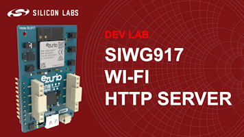
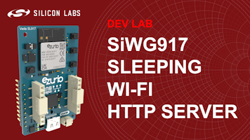
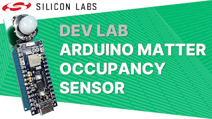
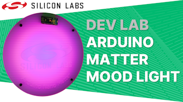
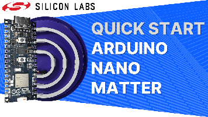
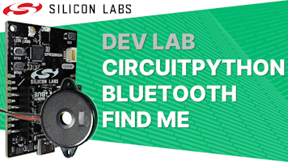
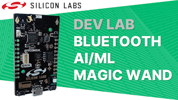
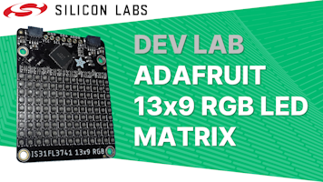

# Silicon Labs Training Examples #

This repository contains various training examples based on Silicon Labs Hardware and Software.

## Examples ##

### [Dev Lab - SiWG917 Sleeping Wi-Fi HTTP Server](dev_lab_wifi_http_server/README.md)

This two-part project-based Dev Lab walks through the creation of a Wi-Fi HTTP Server using the Silicon Labs energy-efficient SiWG917 Wi-Fi 6 SoC. 

The first part starts with the basic HTTP Server example which is included in the Simplicity Studio v5 IDE. The application is then enhanced to serve an auto-refreshing HTML page that includes a timer value and button states. The joining and rejoining process is also improved to make it more robust. The APIs used to create the application are covered along the way.

The second part shows how to apply sleep modes using code and Software Components  to the application to save power, including the use of Simplicity Studio's Energy Profiler to measure the current of the application.

### [Dev Lab - Arduino Matter over Thread Occupancy Sensor](dev_lab_arduino_matter_occupancy_sensor/README.md)

This project-based Dev Lab steps through the creation of a Matter over Thread Occupancy Sensor in the Arduino IDE using the Arduino Nano Matter board and an optional SR602 PIR sensor that can be connected on a breadboard. The final device reports its occupancy state to a Matter hub which can be configured to perform actions when the occupancy state changes.

### [Dev Lab - Arduino Matter over Thread Mood Light](dev_lab_arduino_matter_mood_light/README.md)

This Dev Lab walks through the creation of a Matter over Thread Mood Light using the Arduino IDE. The Dev Lab uses the Arduino Nano Matter board and is compatible with other EFR32MG24 boards featuring Silicon Labs EFRMG24 multi-protocol wireless microcontroller. The completed device includes two color bulb endpoints, modes are available to display solid colors, animated gradients between the two colors and a variety of plasma-like animations. The device can be commissioned into Matter ecosystems from Amazon, Google and Apple.

### [Quick Start - Arduino Nano Matter](quick_start_arduino_nano_matter/README.md)

This quick start video introduces the Arduino Nano Matter board and shows how to get started developing Matter over Thread applications. In the video the Matter Dimmable Lightbulb example is adapted to drive and animate a WS2812 RGB LED strip to display the brightness of the light. This example makes the final source code available for download and use.

### [Dev Lab - CircuitPython Bluetooth Find Me](dev_lab_circuitpython_bluetooth_find_me/README.md)

This project-based Dev Lab steps through the creation of a Bluetooth Find Me device using CircuitPython. The device operates as a key finder, playing alert tunes using a passive piezo buzzer when activated. Activation can be triggered from a mobile phone using the EFR Connect application or by pressing a button on another Find Me device.

The video for this Dev Lab is available on [YouTube](https://youtu.be/snjrxlaGtik)

### [Dev Lab - Bluetooth AI/ML Magic Wand](dev_lab_bluetooth_ai_ml_magic_wand/README.md)

This project-based Dev Lab steps through the creation of a Magic Wand that detects gestures drawn in the air, using AI/ML, to control a light over Bluetooth. 

The video for this Dev Lab is available on [YouTube](https://youtu.be/ONrmMEgFYMo)

### [Dev Lab - Adafruit 13x9 RGB LED Matrix](dev_lab_adafruit_13x9_rgb_led_matrix/README.md) 

This Dev Lab integrates Adafruit's 13x9 RGB LED Matrix into Bluetooth and Matter over Thread wireless applications. 

The video for this Dev Lab is available on [YouTube](https://youtu.be/eNGRJq4ZlzU).

### [MG24 Tech Lab](mg24_tech_lab/README.md)

Learn about the features of the EFR32MG24 wireless SoC including advanced AI/ML capabilities while getting hands-on experience with these exercises. 

The videos for this series of Tech Labs can be found in the [Silicon Labs Training Library](https://www.silabs.com/support/training/mg24-tech-lab-workshop-series).

### [Bluetooth SSv5 Lab 2 - iBeacon Component](bluetooth_ssv5_lab2_ibeacon_component/README.md)

This project illustrates how to add an iBeacon component to the base SoC_Empty Bluetooth project found in the Simplicity Studio v5 tools.

The step by step instructions for the labs can be found using the Silicon Labs [Lab Manual](https://docs.silabs.com/bluetooth/3.0/lab-manuals/getting-started-with-bluetooth-in-simplicity-studio-v5#lab-2---turn-soc-empty-into-an-ibeacon-using-project-configurator) and a video covering this material is available in the [Silicon Labs Training Library](https://www.silabs.com/support/training/bg22-series-adding-components-to-bluetooth-design/adding-components-to-bluetooth-Lab-2).

### [Zigbee Boot Camp](zigbee_boot_camp/README.md)

This boot camp walks through the creation of Zigbee projects, the content is presented via the [Zigbee Boot Camp Wiki on GitHub](https://github.com/SiliconLabs/IoT-Developer-Boot-Camp/wiki/Zigbee-Boot-Camp)

## Documentation ##

Official documentation on all Silicon Labs technologies can be found at our [Developer Documentation](https://docs.silabs.com/) page.

## Reporting Bugs/Issues and Posting Questions and Comments ##

To report bugs in the Training Examples projects, please create a new "Issue" in the "Issues" section of this repo. Please reference the board, project, and source files associated with the bug, and reference line numbers. If you are proposing a fix, also include information on the proposed fix. Since these examples are provided as-is, there is no guarantee that these examples will be updated to fix these issues.

Questions and comments related to these examples should be made by creating a new "Issue" in the "Issues" section of this repo.

## Disclaimer ##

The Gecko SDK suite supports development with Silicon Labs IoT SoC and module devices. Unless otherwise specified in the specific directory, all examples are considered to be EXPERIMENTAL QUALITY which implies that the code provided in the repos has not been formally tested and is provided as-is.  It is not suitable for production environments.  In addition, this code will not be maintained and there may be no bug maintenance planned for these resources. Silicon Labs may update projects from time to time.
