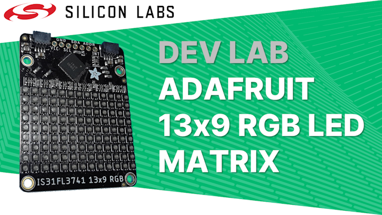

# Dev Lab: Adafruit 13x9 RGB LED Matrix

## About

The video for this Dev Lab is available on [YouTube](https://youtu.be/eNGRJq4ZlzU) where the video description includes links to further information.

This Dev Lab integrates Adafruit's 13x9 RGB LED Matrix into Bluetooth and Matter over Thread wireless applications.

You will learn:

* How to add a driver for the LED matrix into existing applications
* How to draw icons on the LED matrix
* How to control the LED matrix when lighting commands are received in a Bluetooth and Matter over Thread application
* How to enable development Matter over Thread devices in Google Home's ecosystem 

## Files and Folders

**Common Folder:** Contains code used in both the Bluetooth and Matter over Thread examples, including extra modules to draw padlocks on the matrix in addition to the light bulbs shown in the video

**Bluetooth Folder:** Contains the final application code for the Bluetooth example

**Matter Folder:** Contains the final application code for the Matter over Thread example
