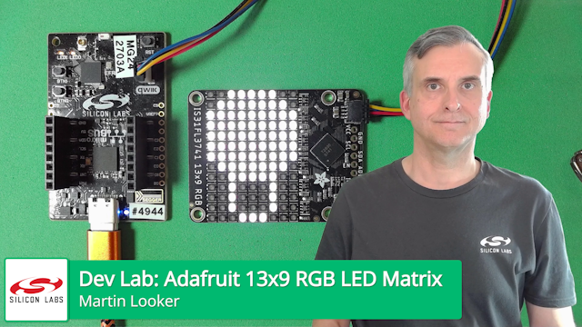

# Dev Lab: Adafruit 13x9 RGB LED Matrix
 

This folder contains source code used in the Dev Lab: Adafruit 13x9 RGB LED Matrix training video.

The folders are arranged as follows:

* `Common` contains code used in both the Bluetooth and Matter over Thread examples
* `Bluetooth` contains the final application code for the Bluetooth example
* `Matter` contains the final application code for the Matter over Thread example

## About

**Description:**

This Dev Lab integrates Adafruit's 13x9 RGB LED Matrix into Bluetooth and Matter over Thread wireless applications.

You will learn:

* How to add a driver for the LED matrix into existing applications
* How to draw icons on the LED matrix
* How to control the LED matrix when lighting commands are received in a Bluetooth and Matter over Thread application
* How to enable development Matter over Thread devices in Google Home's ecosystem 

**Links:**

Visit the Silicon Labs Third-party Hardware Drivers extension on GitHub for to download and install support in Simplicity Studio: https://github.com/SiliconLabs/third_party_hw_drivers_extension

Visit the Google Home Developer Console to enable development Matter devices: https://console.home.google.com/projects

Visit Adafruit's IS31FL3741 13x9 PWM RGB LED Matrix page for further information about the matrix board: https://www.adafruit.com/product/5201
