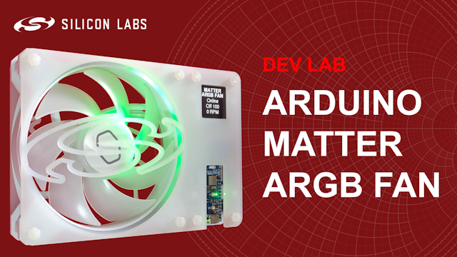
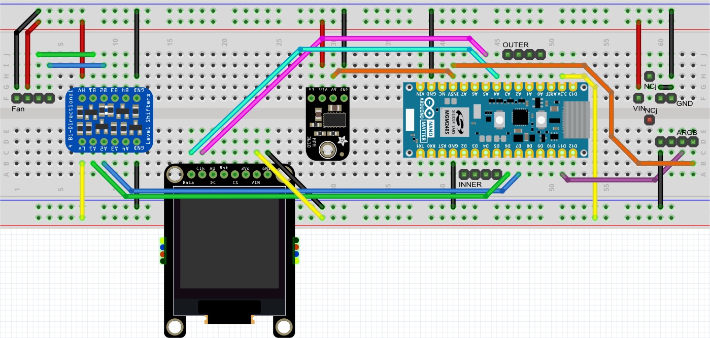
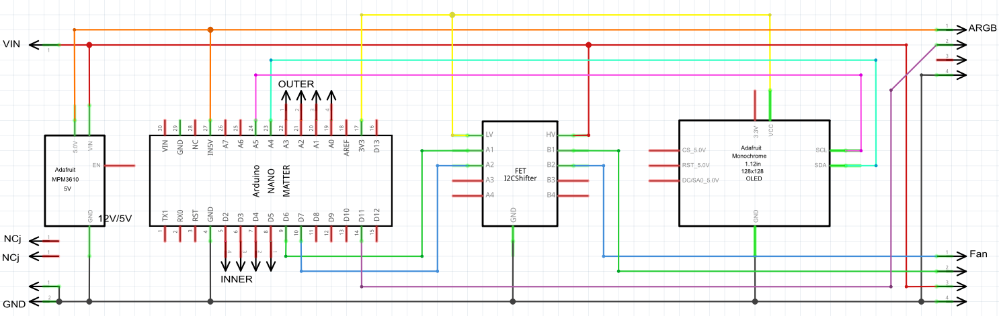

# Dev Lab: Arduino Matter over Thread ARGB Fan

## About 

The video for this Dev Lab is coming soon to YouTube, where the video description includes links to further information.

This project-based Dev Lab steps through the creation of a Matter over Thread ARGB Fan in the Arduino IDE using the Arduino Nano Matter board, an ARGB fan, OLED and other components. The device has the following features:

- Implements a Matter fan
- Controls a 12V 120mm PC fan using PWM
- Measures the fan's RPM reading
- Animates the fan's ARGB LEDs relative to the measured RPM
- Displays the fan's Matter state, mode, speed percentage setting and measured RPM on the OLED, also displays the commissioning QR code when waiting to be commissioned
- The fan can be controlled via a Matter app or voice assistant or the on-board button

## Usage

### Commissioning

Commissioning into a Matter over Thread network follows the normal process of scanning a QR code or entering a manual code in the app for your chosen Matter ecosystem. Example applications created in the Arduino IDE use test certificates, you may be prompted to accept these during commissioning.

### Output Indicators

The ARGB LEDs and on-board LED are red during commissioning and rejoining. The LED animations speed up as the commissioning and rejoining stages are stepped through. The OLED also displays the Matter state during commissioning and rejoining.

Once in a network, the ARGB LEDs and on-board LED are green when the fan is in the off state and blue when in an on state. The LED animation speed is relative to the speed of the fan. The OLED displays the fan's mode and speed percentage setting plus the measured RPM reading.

### Input Controls

The fan can be controlled by an ecosystem app or voice assitant. Pressing the on-board button will cycle through the fan modes.

## Software

Software can be found in the `software` sub-folder. This code was developed in the Arduino IDE v2.3.6 with the Silicon Labs Arduino Core v3.0.0. It also requires the following two libraries:

* **Adafruit SH110X** by Adafruit v2.1.13
* **QRCode** by Richard Moore v0.0.1

## Hardware

### Files

Hardware files can be found in the `hardware` folder. The following files are available:

- **arduino_matter_argb_fan.fzz** - A fritzing file containing layouts for breadboard, schematic and PCB
- **arduino_matter_argb_fan_gerbers.zip** - Zipped gerbers for PCB production
- **arduino_matter_argb_fan_top.svg, arduino_matter_argb_fan_bottom.svg** - SVG files for laser cutting an enclosure from acrylic sheets
- **arduino_matter_argb_fan_bom.xlsx** - Bill of Materials

### Components

The application makes use of the following hardware components:

- [Arduino Nano Matter](https://store.arduino.cc/products/nano-matter)
- A 12V PWM 4-wire ARGB fan, such as the [Cooler Master MasterFan MF120 Halo 2](https://www.coolermaster.com/en-global/products/masterfan-mf120-halo2-white-edition) or [Arctic P12 PWM PST A-RGB](https://www.arctic.de/en/P12-PWM-PST-A-RGB/P12A-RGB0dB)
- [Adafruit 128x128 Monochrome OLED](https://www.adafruit.com/product/5297)
- [Adafruit BSS138 Logic Level Converter](https://www.adafruit.com/product/757)
- [Adafruit MPM3610 5V Buck Converter](https://www.adafruit.com/product/4739)
- [Breadboard-friendly 2.1 mm Barrel Jack](https://thepihut.com/products/breadboard-friendly-2-1mm-dc-barrel-jack)
- 12V 2A Power Supply
- Headers, standoffs, nuts, bolts and acrylic sheets

