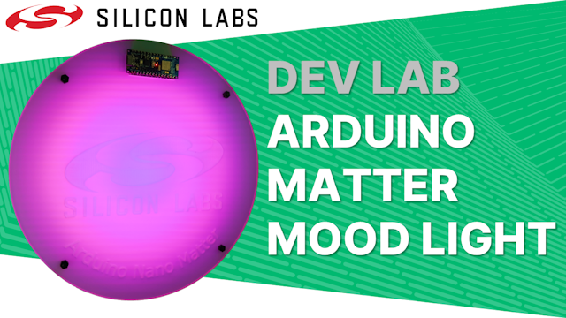
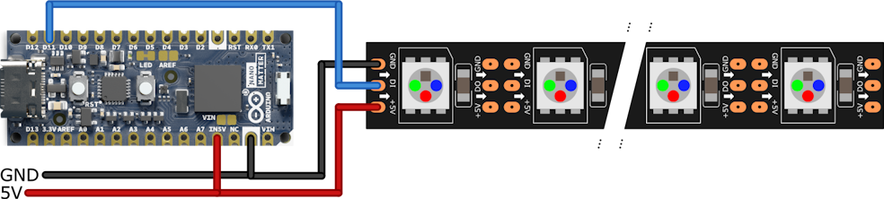
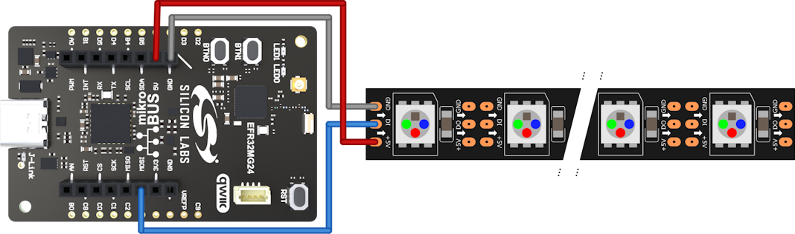
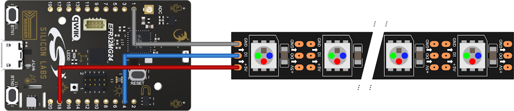
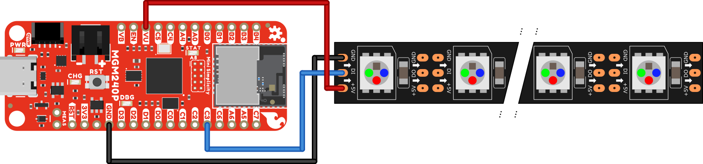

# Dev Lab: Arduino Matter over Thread Mood Light

## About

The video for this Dev Lab is available on [YouTube](https://youtu.be/IpvyQGEW5cw), where the video description includes links to further information.

This project-based Dev Lab steps through the creation of a Matter over Thread Mood Light in the Arduino IDE using the Arduino Nano Matter board and WS2812 RGB LEDs.

The final device has the following features:

* Implements a single Matter over Thread Device with two Color Bulb endpoints
* Two modes display the solid colors set in the endpoints
* Two modes display an animated gradient between the colors set in the endpoints, one using the short path round the color wheel and the second uses the long path
* Four modes display an animated plasma effect between the colors set in the endpoints using the two gradients calculated in the gradient mode

## Usage

### Commissioning

Commissioning into a Matter over Thread network follows the normal process of scanning a QR code or entering a manual code in the app for your chosen Matter ecosystem. For Google Home you *may* need to enable test certificates in the Google Developer Console for your Google Home account, the [Quick Start - Matter in Google Home](https://youtu.be/R_kpSO7PtUo) YouTube video walks through this process.

A URL to the QR Code and the manual code are both output by the application to the serial port during start up. 

The mood light effects are not displayed until the device is commissioned and connected to the Matter over Thread network.

### WS2812 RGB LED Indications

When waiting to be commissioned the RGB LEDs are set to dim magenta.

When waiting for a connection or reconnection the RGB LEDs are set dim yellow.

When waiting to come online in the Matter network the RGB LEDs are set to dim cyan.

When using the button 0 to factory reset on start up the RGB LEDs are set to dim red.

### Mode Control - Button and LED

Holding button 0 for 5 seconds at start up will factory reset the board and take it back into commissioning mode.

Button 0 cycles through the display modes with LED 0 indicating the current mode as follows:

| Mode | Description                                                  | LED                             |
| ---- | ------------------------------------------------------------ | ------------------------------- |
| 0    | Solid 0: All LEDs are set the color of bulb 0                | Off, brief single flash on      |
| 1    | Solid 1: All LEDs are set to the color of bulb 1             | Off, brief double flash on      |
| 2    | Gradient (short): Animated gradient between the colors of bulb 0 and 1, short path round the color wheel | Off, brief triple flash on      |
| 3    | Gradient (long): Animated gradient between the colors of bulb 0 and 1, long path round the color wheel | Off, brief quadruple flash on   |
| 4    | Plasma (slow, short): Animated slow plasma effect between the colors of bulb 0 and 1, short path round the color wheel | On, brief single off period     |
| 5    | Plasma (slow, long): Animated slow plasma effect between the colors of bulb 0 and 1, short path round the color wheel | On, brief double off periods    |
| 6    | Plasma (fast, short): Animated fast plasma effect between the colors of bulb 0 and 1, short path round the color wheel | On, brief triple off periods    |
| 7    | Plasma (fast, long): Animated fast plasma effect between the colors of bulb 0 and 1, short path round the color wheel | On, brief quadruple off periods |

## Software

This code was developed in the **Arduino IDE** v2.3.0 with the **Silicon Labs Arduino Core** v1.0.0 using the *xG24 Explorer Kit (Matter) (precomp)* board variant. The **Quick Start - Matter over Thread for Arduino** YouTube video walks through the process of setting up this development environment and instructions can be found in the Silicon Labs Arduino Core repository read me on GitHub.

The Dev Lab works through three steps to implement the final device with the code for each step being held in its own folder, just open the .ino file from the folder you want to work with in the Arduino IDE.

**moody_1_solid** - Contains the source code for the first step which displays one of two solid colors on all the RGB LEDs

**moody_2_gradient** - Contains the source code for the second step which displays an animation of one of two gradients between the two selected colors

**moody_3_noise** - Contains the source code for the the final step which displays an animation of plasma-like noise using one of the two gradients implemented in the previous step.

**moody_4_final** - Adds some additional improvements: a more subtle noise image is used, holding button 0 for 5 seconds at start up will factory reset the device so it can be moved to a new network, setting `WAIT_ONLINE` to `false` immediately displays the mood light effects without waiting to be commissioned or to come online.

## Hardware

The software is written to run on the Arduino Nano Matter board but is also compatible with other Silicon Labs EFR32MG24 development boards. Wiring diagrams for compatible boards are shown below. Some boards are able to provide 5V power for WS2812 LEDs however, they can draw a lot of current and external power supply is advised. 

### Arduino Nano Matter

### Silicon Labs xG24 Explorer Kit

### Silicon Labs xG24 Dev Kit

### SparkFun Thing Plus MGM240P Matter

This board does not have an on-board button so a button also needs to be added and the code slightly adjusted to monitor it.

## Other Resources

The **fritzing** folder contains a file with breadboard, schematics and PCB layouts for a small board that allows a barrel jack and WS2812 wiring to be connected to the Arduino Nano Matter board. There are also options to add I2C lines, a switch with resistor and a piezo buzzer, though these are not used in this project. There is also a ZIP file with gerbers for the PCB.

The **enclosure** folder contains SVG images and lightburn files that can be used to laser cut acrylic for the enclosure shown in the video
