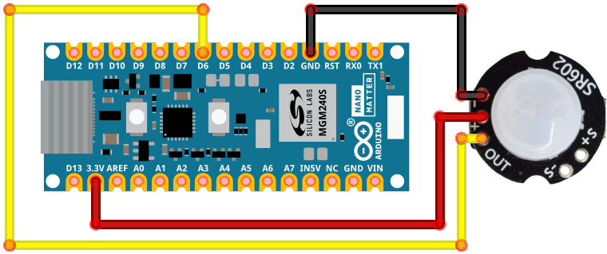
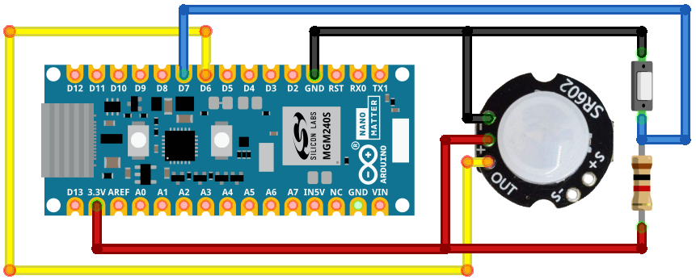

# Dev Lab: Arduino Matter over Thread Occupancy Sensor

## About

This code was created for the **Works With 2024 - Hands-on with the Arduino Nano Matter** session.

This project-based Dev Lab steps through the creation of a Matter over Thread Occupancy Sensor in the Arduino IDE using the Arduino Nano Matter board and an optional SR602 PIR sensor that can be connected on a breadboard. The final device reports its occupancy state to a Matter hub which can be configured to perform actions when the occupancy state changes.

## Usage

Three different versions of the code are available, each in a separate folder. The input and output pins are set with #defines allowing the code to be adapted for other boards.

### Commissioning

Commissioning into a Matter over Thread network follows the normal process of scanning a QR or entering a manual code in the app for your chosen Matter ecosystem. For Google Home you *may* need to enable test certificates in the Google Developer Console for your Google Home account, the [Quick Start - Matter in Google Home](https://youtu.be/R_kpSO7PtUo) YouTube video walks through this process.

A URL to the QR Code and the manual code are both output by the application to the serial port during start up. 

The occupancy state is not monitored until the device is commissioned and connected to the Matter over Thread network.

### PIR Occupancy Sensor

The code for this version is in the **pir_matter_occupancy_sensor** folder.

This version reads the output from a SR602 PIR sensor connected to the D6 pin of the Arduino Nano Matter. When the input is high the state is set to occupied and when low set to unoccupied. The green channel of the RGB LED is lit when occupied.

### Button Occupancy Sensor

The code for this version is in the **btn_matter_occupancy_sensor** folder.

This version can be run on the Arduino Nano Matter board, without additional hardware, each press of the on-board button toggles between the occupied and unoccupied states. The red channel of the RGB LED is lit when occupied.

### PIR/Button Occupancy Sensor

The code for this version is in the **pir_btn_matter_occupancy_sensor** folder.

This combines the above versions and uses a second button, connected to D7 with a 1k pullup resistor, to swap between PIR and button modes. When in PIR mode the green channel of the RGB LED is lit. When occupied the red channel of the RGB LED is lit.

## Other Resources

The **fritzing** folder contains a file with breadboard, schematics and PCB layouts for a small board that the Arduino Nano Matter and SR602 PIR sensor can be plugged into. The second button with its pullup resistor can also be added. There is also a ZIP file with gerbers for the PCB.

The **ww24** folder contains a PDF of the presentation shown at Works With 2024
