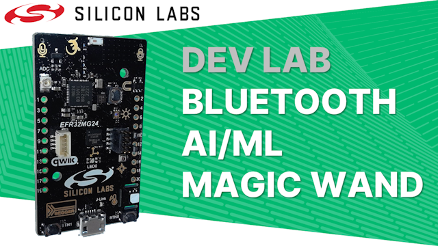

# Dev Lab: Bluetooth AI/ML Magic Wand

## About

The video for this Dev Lab is available on [YouTube](https://youtu.be/ONrmMEgFYMo) where the video description includes links to further information. 

This project-based Dev Lab steps through the creation of a Magic Wand that detects gestures drawn in the air, using AI/ML, to control a light over Bluetooth.

In this Dev Lab you will learn:

- About machine learning at the edge

- How to flash the Bluetooth demo light application

- About the xG24 Dev Kit

- How to create a Bluetooth bootloader

- About machine learning in embedded systems

- How to create the Magic Wand project

- How to add software components to a project

- About AI/ML data models

- About standard bluetooth application functions

- About the magic wand source code

- How to operate the magic wand

## Gecko SDK

This application and the companion video makes use of Simplicity Studio's Gecko SDK with the release of the Simplicity SDK the Simplicity Studio IDE now installs the Simplicity SDK as the default option. To make use of this application follow the instructions below to install and use the Gecko SDK (instead of the Simplicity SDK).

A porting guide for AI/ML applications from the Gecko SDK to the Simplicity SDK will be linked here when available. The final Bluetooth Magic Wand application will be updated for the Simplicity SDK and made available as an example application within Simplicity Studio.

1. In **Simplicity Studio**, click the Install button
2. In **Installation Manager**, click **Manage Installed Packages**
   
3. Click the **SDKs** tab
4. In the **Gecko SDK** box, click the **Add** button
   
5. In the **Add new Gecko SDK** window, click the **Finish** button to install
   
6. Go to the **Launcher** perspective in **Simplicity Studio**
7. Connect and select your board in the **Debug Adapters** panel
8. Select the **Overview** tab
9. Ensure that the **Preferred SDK** down-down has **Gecko SDK Suite** selected
   
10. In the **Example Projects and Demos** tab, you can now create examples using the Gecko SDK, including the **Bluetooth - SoC Blinky** and **Bluetooth - SoC Empty** used by this application.
    

## Files and Folders

**Binary Folder:** Contains the binary file for the completed application for the xG24 Dev Kit (BRD2601B)

**Source Folder:** Contains the source code files and AI/ML data model for the application
