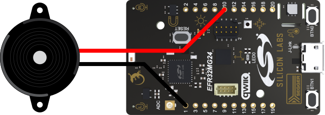

# Dev Lab: CircuitPython Bluetooth Find Me

## About

The video for this Dev Lab *will be* available on YouTube, where the video description includes links to further information.

This project based Dev Lab steps through the creation of a Find Me Bluetooth device, such as a key finder, using CircuitPython as the development language. 

The final device has the following features:

- Implements a Bluetooth device that conforms to the Bluetooth SIG Find Me profile
- Acts as a target device where an alert can be triggered remotely, including from a mobile phone
- Acts as a locator device where an alert can be triggered in remote target devices
- Audio alerts play RTTTL phone ringtones on a passive piezo buzzer using PWM output
- LEDs indicate the status of the device, including the alert state
- Buttons are used to control the operation of the device

## Usage

Two LEDs and two buttons are used to display status and control the device these are named mild and high to match the alert levels that can be set in the device. The passive piezo buzzer also plays RTTTL tunes when an alert state is set.

The LEDs and button assignments on each board are shown in the table below (see the Hardware section below for wiring information):

| Board / Name          | LED High       | LED Mild | Button High    | Button Mild    |
| --------------------- | -------------- | -------- | -------------- | -------------- |
| **xG24 Explorer Kit** | LED1           | LED0     | BTN1           | BTN0           |
| **xG24 Dev Kit**      | RED            | BLUE     | BTN1           | BTN0           |
| **SparkFun MGM240P**  | External (PB0) | STAT     | External (PB2) | External (PB4) |

### LED Indications

| Indication                                              | Meaning                                                      |
| ------------------------------------------------------- | ------------------------------------------------------------ |
| High and Mild flash on briefly together once per second | Device is advertising as a target                            |
| High flashing rapidly                                   | Device is set to high alert level as a target, the piezo will play a tune in this state |
| Mild flashing rapidly                                   | Device is set to mild alert level as a target, the piezo will play a tune in this state |
| High on with a brief off period once per second         | Device is acting as a locator and will connect to any found targets to set them to high alert level |
| Mild on with a brief off period once per second         | Device is acting as a locator and will connect to any found targets to set them to mild alert level |
| High and Mild both on                                   | Device is cancelling its operation as a locator and attempting to cancel alerts on target devices |

### Button Controls

Button functions are activated when the button is pressed.

In the final implementation a device in locator mode will continually scan for new target devices to activate.

The locator will attempt to place newly discovered targets into an alert state three times at 1s intervals, this provides retries for alerting devices but also allows alerts to be cancelled on the target devices without them being reactivated. The Bluetooth connection is closed after writing and is not maintained.

When exiting locator mode three attempts are made at 1s intervals to cancel the alert on each activated target device. If the locator has moved out of range of an activated target the alert will need to be cancelled on the target device. The Bluetooth connection is closed after writing and is not maintained.

| State                                            | Button Controls                                              |
| ------------------------------------------------ | ------------------------------------------------------------ |
| Device is in target mode, alert level is set     | Any: Cancels alert on local device (will be turned back on if a nearby locator is still writing to that device) |
| Device is in target mode, alert level is not set | High: swaps to locator mode setting high alert on any found targets  Mild: swaps to locator mode setting mild alert on any found targets |
| Device is in locator mode                        | Any: Cancels locator mode, clears alerts in target devices and returns to target mode |

### EFR Connect

The EFR Connect mobile application, available for iOS and Android, can also be used to trigger alerts as follows:

1. Initiate a scan for devices
2. Connect to any device named "*xxxx* Find Me" (where *xxxx* is a unique id for each device)
3. In the Immediate Alert service click More Info
4. Click Write below the Alert Level characteristic
5. Select and alert level from the dropdown, then click the Send button

## Software

This code was developed using CircuitPython 8.2.8 (2023-11-16) and uses libraries from the 8.x 2023-11-21 library bundle. To program your device copy the files and folders, from one of the folders listed below, into the root of your CircuitPython device.

**device_root_1_hardware:** Contains the software for step 1 which allows the operation of the device hardware to be tested. 

**device_root_2_target:** Contains the software for step 2 which acts as a Bluetooth Find Me target device only. 

**device_root_3_simple_locator:** Contains the software for step 3 which adds the ability to act as a locator device in addition to a target device. The simple locator continuously places any devices it finds into an alert state, alerts that are cancelled on a target device will be reactivated if the locator remains in range. Returning from locator to target mode does not remotely cancel any activated targets. To cancel alerts with this software first requires returning the locator to target mode, then cancelling alerts locally on the target devices.

**device_root_4_advanced_locator:** Contains the software for step 4 which limits the number of alert writes to each discovered target (to avoid reactivation) and attempts to cancel alerts raised on any target devices when returning to target mode.

## Hardware

The software will run on three different development boards featuring the EFR32MG24 wireless microcontroller. The software will run without a piezo buzzer by indicating alert status on the LEDs, but adding a passive piezo buzzer will allow the audio alerts to be heard. 

The assignment of pins to functions can be found at the start of App.py and can be altered as necessary. The default assignments for external components are described in the sections below.

### Silicon Labs xG24 Explorer Kit

This is simplest board to work with as the passive piezo buzzer can be easily connected to the mikro BUS connector if you add pins to the passive piezo buzzer wires. The LEDs and buttons are already present on this board. 

The table and image below show the required connections:

| xg24 Explorer Kit | External Components           |
| --------------------- | ----------------------------- |
| mikro BUS: GND        | Passive Piezo: Ground (black) |
| mikro BUS: PWM (PA0)  | Passive Piezo: Signal (red)   |

### Silicon Labs xG24 Dev Kit

This board also has the required buttons and LEDs on board, but the passive piezo buzzer needs to be connected to the expansion header slots at the side of the board. You may find it easier to fit header sockets to the Dev Kit and pins to the passive piezo buzzer. 

This board also has a slot for a coin cell and a connector for an external battery for portable use. 

The table and image below show the required connections:

| xg24 Dev Kit            | External Components           |
| ----------------------- | ----------------------------- |
| Expansion: pin 1 (GND)  | Passive Piezo: Ground (black) |
| Expansion: pin 10 (PA7) | Passive Piezo: Signal (red)   |

### SparkFun Thing Plus MGM240P

The software will also run on this board but you will need to add an LED and two buttons in addition to the piezo buzzer. 

This board has a connector for an external battery for portable use.

The table below shows the required connections and the wiring diagram shows breadboard wiring with rows of header pins for the SparkFun board:

| xg24 Dev Kit | External Components                 |
| ------------ | ----------------------------------- |
| GND          | Passive Piezo: Ground (black)       |
| C7           | Passive Piezo: Signal (red)         |
| B0           | LED+ (with 2.2k pull-down resistor) |
| A4           | Button+ (with 1k pull-up resistor)  |
| B2           | Button+ (with 1k pull-up resistor)  |

