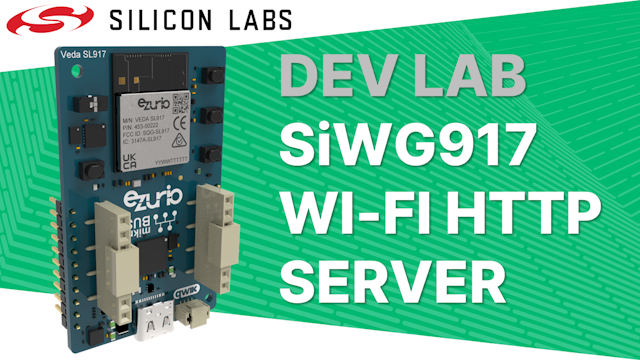

# Dev Lab: SiWG917 Wi-Fi HTTP Server

## About

A video that walks through this Dev Lab will be uploaded to YouTube in the near future along with an update to this readme.

This project-based Dev Lab starts with the basic HTTP Server example application built into Simplicity Studio v5 and enhances it to serve an auto-refreshing webpage with a second timer and the state of the buttons on a development kit. 
