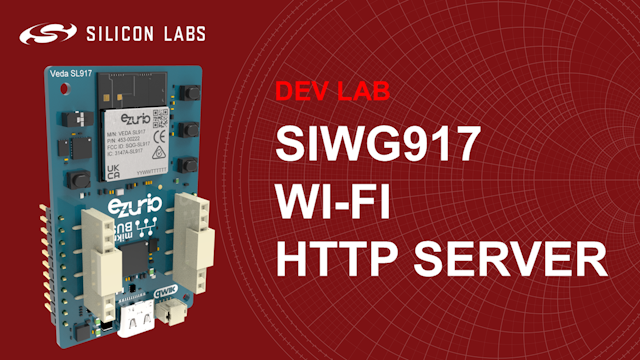
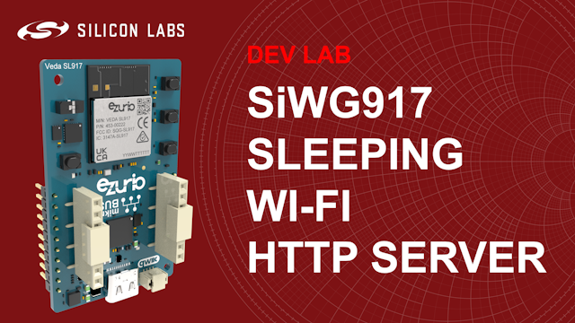

# Dev Lab: SiWG917 Sleeping Wi-Fi HTTP Server

## About

Two videos for this Dev Lab are available on YouTube:

### [SiWG917 Wi-Fi HTTP Server](https://get.silabs.com/gh963yt)

This project-based Dev Lab walks through the creation of a Wi-Fi HTTP Server using the Silicon Labs energy-efficient SiWG917 Wi-Fi 6 SoC. In the video you will how to:

* Connect and setup SiWG917 boards in the Simplicity Studio v5 IDE
* Create, build and run the Wi-Fi HTTP Server example application
* Adapt the application to serve an auto-refreshing HTML page which includes the board button states
* Make the joining and rejoining process robust
* How to use software APIs to construct Wi-Fi applications for the SiWG917

### SiWG917 Sleeping Wi-Fi HTTP Server

This video is coming soon and provides step-by-step instructions for adding sleep modes to the HTTP Server in order to save power. It covers:

* How to measure power using Simplicity Studio's Energy Profiler
* How to enable the Network Wireless Processor (NWP) sleep modes using code
* How to enable the Application Processor (M4) sleep modes using code and Software Components

## Folders

**presentation:** Contains a PDF presentation of the Dev Lab to help you follow along with the video

**source_1_server:** Contains updated source code to serve the auto-refreshing HTML page

**source_2_rejoin:** Contains updated source code to make joining and rejoining more robust

**source_3_nwp_sleep:** Contains source code that allows the Network Wireless Processor to sleep

**source_4_nwp_m4_sleep:** Contains source code that allows the Application Processor to sleep
