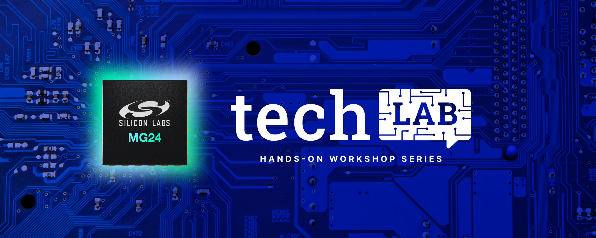
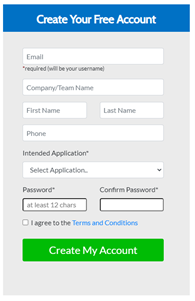

# MG24 Tech Lab #
   

   
   

## Summary ##

The videos for this series of Tech Labs can be found in the [Silicon Labs Training Library](https://www.silabs.com/support/training/mg24-tech-lab-workshop-series).

Learn about the features of the EFR32MG24 wireless SoC including advanced AI/ML capabilities while getting hands-on experience with these exercises. Each project session will explore and solve challenges developers often face when designing battery-powered IoT end devices.

Session contents:

- **Topic 1:  Unboxing the MG24 and AI/ML Foundations**
  - Introduction to xG24
  - Introduction to the SSv5 environment
  - Getting started lab to explore you development kit and prepare for the AI/ML session
- **Topic 2:  Accelerate AI/ML at the Edge with xG24 and SensiML**
  - SensiML’ s Analytic Toolkit for developing inference models
  - Demonstrating acoustic event recognition for smart home and predictive maintenance applications
  - Hands-On: Deploying inference model to xG24 to recognize acoustic events
- **Topic 3:  Accelerate AI/ML at the Edge with xG24 and Edge Impulse**
  - Developing inference models with Edge Impulse Studio
  - Demonstrating vision application enabled by AI/ML at the edge
  - Hands-On: Deploying inference model to xG24 for Wake-Word Detection
- **Topic 4:  How to Use Peripherals and Sensors to Gather and Report Data**
  - Recap the ML use case from session 2
  - Show how to implement the peripherals needed to enable the use case highlighting the xG24 part and tools (or highlight how the 3rd parties have implemented them, I am not familiar with their solutions at this point).
  - Create the end Bluetooth application that takes the third party library created in session 2 and integrates it with the stack.
  - Lab output connects to EFR Connect to show results

## Hardware Requirements ##

- [One EFR32xG24 Dev Kit](https://www.silabs.com/development-tools/wireless/efr32xg24-dev-kit)
- Micro-USB to USB Type-A Cable
- Mobile Phone
## Software Requirements ##

- [Simplicity Studio v5](https://www.silabs.com/products/development-tools/software/simplicity-studio/simplicity-studio-5)
  - GSDK v4.0.2
  - Bluetooth SDK 3.3.2
- [EFR Connect Mobile App](https://www.silabs.com/products/development-tools/software/bluetooth-low-energy/mobile-apps/efr-connect)

## AI/ML Partner Tools ##

This workshop will allow you to evaluate two Third Party Partner Tools for topics 2 and 3 of the series. For an ML Explorer, these tools cover the end-to-end workflow for creating a machine learning neural network model and accompanying embedded software to include in your application. To use the tools, you will need to create an account on our partner’s website and intall their tools prior to attend-ing topics 2 and 3

**Topic 2:  Accelerate AI/ML at the Edge with xG24 and SensiML**

1. Sign-up for SensiML Community Edition (free forever tier of SensiML Analytics Toolkit). Go to the link below, en-ter your account information, and click ‘Create My Account’.

    [Community Edition Sign-up Link](https://sensiml.com/plans/community-edition/)  
    

    - You will receive an email at the address you provided in the form to validate the account.

    - Open the account validation email and click the activa-tion link to enable your account.

2. After the account is created, walkthrough the steps outlined under [“What you need to get started”](https://urldefense.com/v3/__https:/sensiml.com/documentation/application-tutorials/guitar-tuning-notes-audio-recognition.html*what-you-need-to-get-started__;Iw!!N30Cs7Jr!Th2X3-XVL4SHFRV9t8ROVmcaPryzq0HT88lOQQkO1OB3MiqWLAjE1uXhGm1yb3nMx5PESQznJq4EbE1FZwyyNf8PEg$) of the Guitar Note Audio Recognition demo prior to attending Topic 2.

**Topic 3:  Accelerate AI/ML at the Edge with xG24 and Edge Impulse**

Edge Impulse is a development platform that can be used to create intelligent device solutions with machine learning on embedded devices. This section will go over getting set up with Edge Impulse.

1. Create an account on Edge Impulse’s website [HERE](https://studio.edgeimpulse.com/signup?next=%2Fstudio%2Fselect-project%3Fautoredirect%3D1).

2. Install Edge Impuse CLI using the procedures outlined [HERE](https://docs.edgeimpulse.com/docs/edge-impulse-cli/cli-installation).