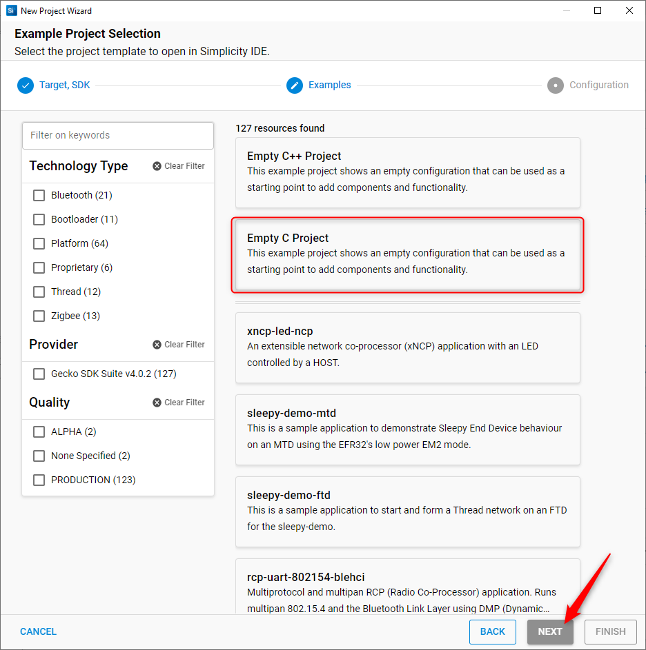
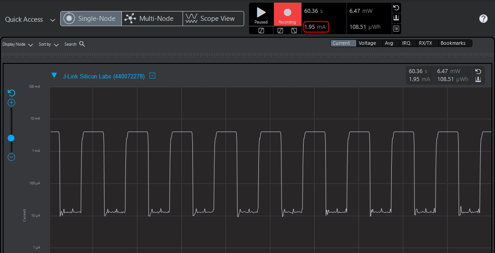

# Unboxing the MG24 and AI/ML Foundations - Lab <!-- omit in toc -->

## Overview <!-- omit in toc -->

This lab procedure explains how to create a bare metal application that collects sensor data using the EFR32xG24 dev kit (BRD2601B), Simplicity Studio 5 Gecko Platform and Project Configurator Wizard, and the *process-action* programming model.  Multiple software components within the Gecko Platform are used as building blocks for the application, which are described in more detail below.

This lab focuses on data gathering from the microphones, RHT, and IMU sensors from the development kit. The application developed in this lab is highly configurable and can be further extended to add other sensors also available on the board, such as the ambient light and pressure sensors. Energy consumption is maintained low whenever possible by allowing the device to sleep.

The lab has four main phases, with each phase building upon the last. The first phase shows how to build a new project and select the necessary software components. The second phase shows how to integrate application code and leverage the installed components. The third phase focuses on the application, its operation, and how it can be configured. Lastly, the final phase covers testing the application and observing current consumption using the energy profiler.

AI/ML topics are NOT covered in this lab. See the following sessions in the workshop series for more information.

<div style="page-break-after: always"></div>

## Prerequisites <!-- omit in toc -->

For this lab you'll need the following:

### Hardware <!-- omit in toc -->

1. EFR32xG24 Dev Kit xG24-DK2601B (BRD2601B)
2. Micro-USB to USB Type-A cable
3. WSTK BRD4001A or WSTK PRO BRD4002A
   * Optional for Energy Profiling in Simplicity Studio

### Software <!-- omit in toc -->

1. Simplicity Studio v5
   * Gecko SDK Suite 4.0.2 or later
2. Accompanying lab source code downloadeable from the [**Trainign_examples** GitHub repository][TRAINING_EXAMPLES_REPO_LINK]
   * See section [2. Integrating the application code](#2-integrating-the-application-code) below for details.

<div style="page-break-after: always"></div>

**Table of Contents:**

- [1. Creating and configuring a bare-metal project](#1-creating-and-configuring-a-bare-metal-project)
  - [1.1 Create an empty project using Silicon Labs Project Wizard](#11-create-an-empty-project-using-silicon-labs-project-wizard)
  - [1.2 Exploring the Project structure](#12-exploring-the-project-structure)
  - [1.3 Exploring the Project source files](#13-exploring-the-project-source-files)
  - [1.4 Configuring the project](#14-configuring-the-project)
- [2. Integrating the application code](#2-integrating-the-application-code)
- [3. Interpreting the application code](#3-interpreting-the-application-code)
- [4. Testing and Energy profiler plots](#4-testing-and-energy-profiler-plots)
  - [4.1 Default application behavior](#41-default-application-behavior)
  - [4.2 Current consumption for individual sensors](#42-current-consumption-for-individual-sensors)
  - [4.3 Current consumption for different sampling frequencies](#43-current-consumption-for-different-sampling-frequencies)
- [5. Conclusions](#5-conclusions)
  - [5.1 Application limitations](#51-application-limitations)
- [6. Further references](#6-further-references)
- [ANNEX - API details](#annex---api-details)
  - [IMU Collector - (app_imu_collector.c)](#imu-collector---app_imu_collectorc)
  - [Microphone Collector (app_mic_collector.c)](#microphone-collector-app_mic_collectorc)
  - [RHT Collector (app_rht_collector.c)](#rht-collector-app_rht_collectorc)
  - [Main application (app.c)](#main-application-appc)

<div style="page-break-after: always"></div>

## 1. Creating and Configuring a Bare Metal Project

### 1.1 Create an Empty Project Using Silicon Labs Project Wizard

1. Launch Simplicity Studio v5 IDE.
2. Connect the BRD2601B to your computer using the USB cable.
3. Navigate to the `"File/New/Silicon Labs Project Wizard..."` option in Simplicity Studio.

   <p align="center">
   
   </p>
   <center><i>Figure 1. Project Wizard option location</i></center>

4. The *New Project Wizard* window will pop up. In the *target Boards* text entry field, enter the board used for this lab - BRD2601B.
   >***Note:*** If the board is already connected to the PC, this field will be auto-populated.
5. Verify that the latest GSDK is selected in the *SDK* drop-down menu and that the selected toolchain in *IDE/Toolchain* is GNU ARM v10.2.1.
6. Click the *Next* button to move on to the next configuration window.

   <p align="center">
   
   </p>
   <center><i>Figure 2. New Project Wizard window – Target, SDK, and Toolchain Selection</i></center>

7. In the *Example Project Selection*, select the *Empty C Project* option and click the *Next* button.

   <p align="center">
   
   </p>
   <center><i>Figure 3. New Project Wizard window – Example Project Selection</i></center>

8. In the *Project Configuration*:
   * Specify a name for your project.
   * Use the default project location (you may modify it if required).
   * Select the *Link SDK and copy project sources*.
   * Click *Finish*.

   <p align="center">
   
   </p>
   <center><i>Figure 4. New Project Wizard window – Project Configuration</i></center>

9. Simplicity Studio will create your project and add the required files accordingly.

### 1.2 Exploring the Project Structure

After the Simplicity Studio Project Wizard completes, the new project directory structure and source will display in the *Project Explorer* window located on the left side in the *Simplicity IDE* perspective.

The `*.slcp` file will automatically open in the main window; three tabs are now available when viewing the project's `*.slcp` file:

* **Overview:** Displays information about the target device, SDK selection, and some project details.
* **Software Components:** Project Configurator for simple integration of software tools/drivers for easy integration of peripherals.
* **Configuration Tools:** Quick access to additional configuration tools, depending on installed components (e.g., Pin Tool).

<p align="center">

</p>
<center><i>Figure 5. *.slcp configuration options</i></center>

Looking at the *Project Explorer* window on the left side, you can see the following components:

* **Includes:** List all the paths that the project can refer to find header files during compilation. This is configurable through the Project properties.

   To configure, right-click on the project name and select the option *Properties*. In the pop-up window navigate to the option *C/C++ Build / Settings* and make the necessary modifications under *GNU ARM C Compiler/Includes* and *GNU ARM Assembler/Includes*.

   <p align="center">
   
   </p>
   <center><i>Figure 6. Project Properties - Adding Include paths</i></center>

* **autogen:** This folder contains all the autogenerated source and header files as well as the project's linker file. Its contents depend on the installed software components. These files should NOT be modified as they get regenerated when a component is modified/installed.
* **config:** This folder contains header files related to the installed software components and their configuration. They generally contain preprocessor macros used by the underlying components. They are not intended to be directly modified. Instead, do so by configuring the software component itself through the *Component editor*.
* **Gecko_sdk_x.x:** This folder contains the linked gecko SDK files. As software components are added, their source code is included in this folder.
* **Source files (app.c and, main.c):** Their contents are covered in the following section.
* **Configuration files:**
  * `*.slcp:` Project file that describes a software application and its components, used to generate an IDE project template. This file serves also as the main GUI interface for configuration.
  * `*.pintool:` Configuration file that shows the current GPIO configurations. This file is populated as software components are installed and configured. Changes in the pintool will enforce the same changes in the respective software component and its configuration files.

### 1.3 Exploring the Project Source Files

Two source files are created by default, as follows:

* **`main.c:`** Contains the top-level initialization routines and a while loop or *super loop* which uses the *process-action* function calls for bare metal applications. If an RTOS is used, the kernel is started and a *task-based* model is followed but that is out of the scope of this lab. The main function calls are:
  * **`sl_system_init():`** Calls a set of automatically generated functions located in *`autogen/sl_event_handler.c`* that handle hardware and software initialization of added components. Don't remove it.
  * **`app_init():`** Located in `app.c` intended for users to add their initialization code.
  * **`sl_system_process_action():`** Process action routine used by specific software components. Don't remove it.
  * **`app_process_action():`** Located in `app.c`  intended for users to add their application routines.
* **`app.c:`** Contains the definition of `app_init()` and `app_process_action()`.

You can add custom source files and execute them from `app.c`, as shown in subsequent sections of this lab.

### 1.4 Configuring the Project

1. Open the `*.slcp` file and navigate to the *Software Components* section.
2. Check the *Installed Components* box to filter by those components already present in the empty project.

   Relevant components are as follows:

   * **Board control:** Specific to Silicon Labs development kits and radio boards. It allows to enabling/disabling board features through GPIO-driven signals.

     >***Note:*** Leave the current configuration as-is. Relevant signals will be controlled from the application.
   * **MX25 Flash Shutdown:** Specific to Silicon Labs development kits and radio boards. It adds code to disable the onboard SPI flash (if applicable) leaving it in a low-energy mode reducing sleep mode consumption. It releases the related USART/EUSART resources after execution.
   * **Device Init:** This series of components configure different hardware features of the device, notably:
     * ***DC-DC:*** Enables and configures the DCDC converter. Note that most of the Silicon labs kits use the DCDC converter to reduce energy consumption.
     * ***HFXO and LFXO:*** Configurations based on the presence of an external HF or LF crystal, including parameters such as CTUNE, frequency...
       * Note that the presence of these components affects the clock configuration of the device, which means that the HFXO will be selected as the source for HF clock branches and the LFXO as the source for LF clock branches if the ***Device Init: Clocks*** component is installed.

3. Uncheck the *Installed Components* box to have access to the whole software component catalog.
4. Find the ***Device Init: EMU*** component and open the Component Editor by clicking on the *Configure* button.
5. Disable the option *Allow debugger to remain connected in EM2*, which will reduce energy consumption while in EM2.

   <p align="center">
   
   </p>
   <center>
   <p align="center">
   
   </p>
   <center><i>Figure 7. Software component configuration</i></center>

6. In the search box, look for the component ***Device Init: DPLL*** and press the *Install* button. Installing this component will automatically configure the relevant HF clock to be sourced by the DPLL.

   This will configure the DPLL to create a clock of double the HFXO frequency (78 MHz). The idea is to perform tasks faster and allow more sleep time.

   >***Note:*** the DPLL is sourced by the HFXO which is disabled while the device is asleep, therefore upon wakeup it needs to be restored impacting the wake-up time.

   <p align="center">
   
   </p>
   <center><i>Figure 8. DPLL software component</i></center>

7. As described in the step above, install the following components:
   1. **Power Manager:** Platform software component that handles the application's energy modes and sleep. It automatically transitions the system to the lowest allowed energy mode after executing the processing functions and is therefore tightly integrated with the Gecko Platform *process-action* programming model. It can also recover external oscillators if required on wake-up.
      * Note that adding this component adds the `sl_power_manager_sleep()` function call to the main.c source file.
      * The lowest allowed EM mode (EM2/EM3) can be configured by clicking the *Configure* button. By default, it's EM2.
   2. **Sleep Timer:** Platform component used to create timers (blocking and non-blocking) that are tightly integrated with the power manager component. It uses a low-frequency hardware timer (SYSRTC, RTCC, BURTC) and from it, multiple software timers can be derived.
      1. Open the component's configuration and select SYSRTC as the Timer Peripheral.
         * Select the hardware timer and clock source based on the application requirements:
           * LFXO - Down to EM2.
           * LFRCO/ULFRC - Down to EM4.
           * Available timers in xG24 are SYSRTC and BURTC.
   3. **I2CSPM:** Driver used for polled I2C communication based on the  I2C EMLIB implementation. Used by other software components that involve I2C communication such as sensor drivers.
      1. When installing, provide a name for the component instance.
         * Since the source code of this lab assumes that the instance is called *sensors*, give it the same name to avoid compilation issues.
      2. Open the component editor and configure the instance as follows:
         * *Selected Module:* I2C1
         * *SCL:* PC04
         * *SDA:* PC05
         >These are the pins used by the Kit for the routed I2C signals. You can select either I2C0 or I2C1 for the I2C module. Note that only I2C0 supports low-energy mode features, such as waking from EM3 on an address match.

        <p align="center">
        
        </p>
        <center><i>Figure 9. I2CSPM software component configuration</i></center>

   4. **Si70xx - Temperature/Humidity Sensor:** Driver for the Si7021 RHT sensor in the development kit.
   5. **I2S microphone:** Driver used for I2S microphones, such as those in the xG24 dev kit.
      * Installing this component will also add the necessary EMLIB components for LDMA and USART and the **DMADRV driver**, a driver implementation for LDMA transfers.
      * This component is automatically configured based on the dev kit's routing.
   6. Open the configuration of the **DMADRV software component** and chose a value of 2 for the *Number of available channels*.
      * These channels will be used for the microphone data. Reducing the number here allows for saving RAM space.
   7. **ICM20689 - Motion Sensor:** Driver for the ICM-20689 IMU sensor.
      * This component is automatically configured based on the dev kit's routing.
   8. **IMU - Device driver for InvenSense ICM-20689:** Middleware driver that leverages the ICM-20689 driver and adds extra APIs for data processing of the IMU raw data.

   Since the captured data is transmitted through serial communication in this demo, add the components for this. If you look at the [UG524: xG24 Dev Kit User's Guide][BRD2601B_USER_GUIDE], the 3.5 On-board Debugger chapter shows the GPIO pins used for the virtual communication port (VCOM). The VCOM is a physical USART/EUSART instance connected to the onboard debugger acting as a UART to USB bridge making communication to a PC possible. For more details, see chapter 4.3 Virtual COM Port chapter in the user's guide. The VCOM is a physical USART/EUSART instance connected to the onboard debugger acting as a UART to USB bridge making communication to a PC possible.

8. Install the following components to enable VCOM communication:
   1. **IO Stream: EUSART:** I/O Stream provides a uniform way to read/write data through different physical interfaces such as EUSART, USART, LEUSART, SWO, and RTT. Installing this component also installs the core driver **IO Stream**.
      1. When installing you'll be prompted to create an instance, use the default name *vcom*.
      2. The instance is preconfigured based on the development kit routing including a baud rate of 115200.
      3. Open the component editor with the *Configure* button and modify the baud rate to 921600.
      4. Disable the *Restrict the energy mode to allow the reception*. Otherwise, the power manager adds an EM1 requirement, which doesn't allow the application to go to EM2.

        <p align="center">
        
        </p>
        <center><i>Figure 10. IO Stream software component configuration</i></center>

   2. **IO Stream: Retarget STDIO:** Retargeting driver of STDIO functionalities to I/O Stream APIs.
      * This allows you to use `printf()` to output data through the VCOM I/O Stream.
   3. **Tiny printf:** Embedded friendly implementation of `printf()`, `sprint()`, and `snprintf()`.

With all the components installed, you're ready to integrate custom code and develop the application.

## 2. Integrating the Application Code

At this point, it's possible to build the project but the output binaries won't do anything apart from the initialization of some of the device-specific features and onboard peripherals based on the software component selection. You have to add application code that leverages these components into a meaningful task.

1. Download the accompanying source code of this session from the **training_examples** GitHub repository into a known location on your computer
   * You can clone the whole repository into your computer using a service like Git bash or GitHub desktop for example with the following [link][TRAINING_EXAMPLES_REPO_LINK].
   * Or, you can download a *.zip* copy of the repository using this [link][TRAINING_EXAMPLES_REPO_ZIP_FILE].
2. Once you clone the repository or extract the *.zip*, navigate to the following location `mg24_tech_lab\session_1\src`, which contains the source code.
3. Copy and paste or drag and drop the source code files into the top directory of your Simplicity Studio project.
4. In the *File Operation* pop-up window, select the option *Copy files* and press *OK*.
5. Another pop-up window will show asking if you wish to overwrite `app.c`, select *Overwrite All*.
6. Locate the *Hammer icon* in the Simplicity Studio tools bar and click it to build the project.
   * >Note: If you used a name other than *sensors* for the I2CSPM instance, you'll face several undefined references in `app_rht_collector.c` as the code expects that name, this can be solved by modifying the source file accordingly.

   <p align="center">
   
   </p>
   <center><i>Figure 11. Build icon</i></center>

7. The application should build without errors or warnings.

   <p align="center">
   
   </p>
   <center><i>Figure 12. Project build warnings and errors</i></center>

8. In the Project Explorer window, you'll find a folder called *GNU ARM v10.2.1 - Debug*, which contains the output files during the linking and compilation process.
9. Right-click on the `*.s37` file and select the option *Flash to Device...*.

   <p align="center">
   
   </p>
   <center><i>Figure 13. Flash to Device option</i></center>

10. In the *Flash Programmer* pop-up window, locate the option **Advanced Settings...** and press it.
11. In the small pop-up window, make sure the option selected is *Page Erase* and press *Ok*.
    * This will ensure that only the necessary pages in flash are erased when flashing a new image. In series 2 devices if the option *Full Erase* is chosen, you will erase your bootloader while flashing your application.
    > Note: No bootloader is required as this is a bare metal application, and this is a series 2 device without a dedicated bootloader region.

    <p align="center">
    
    </p>
    <center><i>Figure 14. Advanced settings and page erase option</i></center>

12. Back in the *Flash Programmer* window, press the button *Program* to flash the application.
13. Upon flashing, in the *Debug adapters* window, right-click on your connected board and select the option *Launch Console* to open the terminal emulator of Simplicity Studio.

    <p align="center">
    
    </p>
    <center><i>Figure 15. Launch Console option</i></center>

14. In the terminal window, select the *Admin* tab, which allows reconfiguring the on-board debugger serial communication.
    * Since the IO Stream component was configured for a baud rate of 921600, do the same for the on-board debugger.

    <p align="center">
    
    </p>
    <center><i>Figure 16. On board debugger baud rate configuration</i></center>

15. Enter the following command: `serial vcom config speed 921600`.
16. You should get the following output message indicating that the onboard debugger baud rate has been updated. The default baud rate is 115200.

    <p align="center">
    
    </p>
    <center><i>Figure 17. Successful on-board debugger baud rate configuration</i></center>

17. Still, in the terminal window, select the *Serial 1* tab, click on the text box entry, and press *Enter* on your keyboard, which will establish communication.
    * Notice the icon in the lower-left corner it will change indicating that the connection is done.

    <p align="center">
    
    </p>
    <center><i>Figure 18. Establishing serial communication</i></center>

18. As the connection is established, you'll observe data being printed every 1 second. This data corresponds to the sensor data that was collected.

    <p align="center">
    
    </p>
    <center><i>Figure 19. Application serial data output</i></center>

## 3. Interpreting the Application Code

With the application running, you should understand its composition and how it operates. As indicated before, the application can gather data from the microphones, RHT, and IMU sensors and send it over its EUSART port every 1 second which can be observed in the connected computer.

The general flow diagram of the application is as follows:

<p align="center">

</p>
<center><i>Figure 20. Application flow diagram</i></center>

Each sensor has a *collector* application responsible for gathering the data, where the main application can recover the collected samples on demand. The collector code for each sensor is similar but certain limitations may apply depending on the underlying driver APIs available, the routing in the board, and the nature of the sensor itself. Each *collector* contains a local buffer that holds the data samples as they are acquired.

While data is collected, the application is allowed to go to a lower energy mode EM1 as the serial peripherals used for communication with the sensors can't be used in lower modes. After all the data is collected, the application is allowed to go to EM2.

The application is timed through the sleep timer component that creates an interrupt every `SENSOR_MEASUREMENT_DELAY_MS` period. If data has been successfully collected, it is printed and a new cycle of measurements is scheduled. The default number of samples and sampling frequency should allow the application to finish collecting data in less than 1 second, allowing the device to sleep the rest of the time reducing the overall current consumption.

A series of flow control variables are used to determine if the data from each sensor has been captured completely and if a new sensing cycle should be scheduled.

For a brief description of each API in this lab source code, see the [ANNEX - API details](#annex---api-details) section and the source code itself.

## 4. Testing and Energy Profiler Plots

The following section contains current measurements of the running application. For this, Simplicity Studio's Energy Profiler was used. Note that the xG24 dev kit by itself DOESN'T support Energy Profiler as it doesn't have the AEM circuitry. Therefore, an external WSTK should be used in `DEBUG MODE OUT` to power the xG24 dev kit and perform AEM current measurements. Nonetheless, other means to measure the current consumption of the board could be implemented and the data plotted to make the same observations.

According to the *AEM Accuracy and Performance* section in radio board user's guides:
> *AEM is capable of measuring current in the range of 0.1 µA to 95 mA. For currents above 250 µA, the accuracy is within 0.1 mA. For currents below 250 µA the accuracy is 1 µA. Even if the absolute accuracy is 1 µA, the AEM circuitry can detect changes as small as 100 nA or 0.1 µA. For this reason, for accurate current measurements, it's always advised to use external high-precision equipment.*

### 4.1 Default Application Behavior

The default configuration of the application is as follows:

* **IMU**
  * Sampling frequency: 500 Hz
  * Samples per cycle: 125
  * Total bytes: 1500 bytes
* **Microphone**
  * Sampling frequency: 16 kHz
  * Samples per cycle: 115
  * Total bytes: 230 bytes
* **RHT**
  * Samples per cycle: 1
  * Total bytes: 8 bytes
* **Data print**
  * Baud rate: 921600 bauds
* **Sensor measurement cycle:** 1 second

The current consumption plot capture using Energy Profiler is as follows:

<p align="center">

</p>
<center><i>Figure 21. Energy profiler capture of running application</i></center>

<p align="center">

</p>
<center><i>Figure 22. Initialization and 1st data capture cycle</i></center>

<p align="center">

</p>
<center><i>Figure 23. Single data capture cycle focus</i></center>

* Figure 21 highlights the initialization (1) and 1st data capturing cycle including the collection time (2) and sleep time (3).
  * Notice the average current consumption of ~1.38mA over the total captured time.
* Figure 22 zooms into the initialization and 1st cycle. (1) Represents the initialization portion and (2) the data capturing.
* Figure 23 zooms into a standalone data capture cycle.
  * Notice the average duration of ~ 310 ms and consumption of ~4.54 µA.

The following are factors that impact the overall current consumption of the application:

1. **Latency:** This translates to how often a new cycle begins; a higher allowed latency (longer cycle periods) leads to lower energy consumption but less data throughput.
2. **The number of samples:** A higher sample count for each sensor will impact the amount of time spent capturing data instead of allowing the device to sleep.
3. **Sampling frequency:** Increasing the sampling frequency means that the total number of samples will be captured faster. Note that some sensors such as the IMU may consume more energy at higher sampling frequencies.
4. **The number of data sources:** The more sensors, the longer the data capturing takes and of course, the energy consumption increases as those sensors are in an active state.
5. **Data processing:** Data processing on the node itself is one of the objectives behind machine learning on the edge and as such will impact the energy consumption of the device. In this application, the processing involves only printing the data (hence why the baud rate of 921600 was selected). But this could implicate filtering and complex operations on top of the processing required for the machine learning model inference.

Configuring the above parameters can be easily done in this lab's application using the `app.c` preprocessor macro symbols, recompiling, and re-flashing the application. For example:

### 4.2 Current Consumption for Individual Sensors

Using the symbols `ENABLE_RHT_SENSOR`, `ENABLE_MICROPHONE` and `ENABLE_IMU_SENSOR`, the application will initialize and use only the enabled sources. The following figures show the current consumption of these individual sources. Note that the sampling frequency and the number of samples are left as default.

<p align="center">

</p>
<center><i>Figure 24. Current consumption - Only RHT sensor</i></center>

<p align="center">

</p>
<center><i>Figure 25. Current consumption - Only microphones, 16 kHz sampling frequency</i></center>

<p align="center">

</p>
<center><i>Figure 26. Current consumption - Only IMU sensor, 500 Hz sampling frequency</i></center>

Notice that the highest consumption comes from the IMU as expected due to the consumption from the sensor itself.

### 4.3 Current Consumption for Different Sampling Frequencies

Notice the effect on average energy consumption when the microphone sampling frequency is halved from 16 kHz to 8 kHz. Note that only the microphone is enabled in this exercise. The average consumption increased from ~537 µA to ~920 µA.

<p align="center">

</p>
<center><i>Figure 27. Current consumption - Only microphones, 8 kHz sampling frequency</i></center>

A similar effect can be observed when halving the sampling frequency of the IMU from 500 Hz to 250 Hz. Note that only the IMU is enabled in this exercise. The average consumption increased from ~0.97 mA to ~1.95 mA.

<p align="center">

</p>
<center><i>Figure 28. Current consumption - Only IMU sensor, 250 Hz sampling frequency</i></center>

These effects make sense considering that the required samples take double the time to get collected compared to the default configuration.

## 5. Conclusions

* Latency, number of samples, sampling frequency, number of sensor sources, and data processing are the five factors that have an important role in a data capturing.
* In general, allowing the application to finish its task as fast as possible will be a preferred approach to allow the device to sleep longer afterward, which translates into lower energy consumption.

The demo created in this lab is not intended to be the most efficient application but serves as a starting point for further development and improvement. It also illustrates how to leverage the onboard peripherals of the xG24 development kit and create a data-capturing application with the software tools provided by Simplicity Studio. Some of the limitations are as follows:

### 5.1 Application Limitations

* The current application doesn't have checks to verify if a given configuration will indeed finish data sampling before the specified sensing cycle.
* The current application doesn't have a timed method to acquire the RHT data.
  * This can be implemented by using a sleep timer instance.
* Software components are not 100% efficient, for example:
  * I2S Microphone component discards the first 4096 samples BEFORE getting the requested samples making the process inefficient when using the `sl_mic_get_n_samples()` API. This happens on each request.
  * IO STREAM follows an interrupt-based approach for data transfer instead of LDMA making the UARTDRV driver a potentially better option.
  * The I2CSPM component is polled based. A custom driver could be done that leverages LDMA.
* Powering the onboard sensors requires a GPIO to be set even while sleeping, which will inherently increase the current consumption in EM2.
* All the I2C sensors in the xG24 dev kit are powered through the same ENABLE signal. Therefore, the current will increase due to the quiescent current consumption of the sensors even if they're not used.

## 6. Further References

### Simplicity Studio v5 topics <!-- omit in toc -->

* docs.silabs.com - [Gecko Platform programming model][DSC_GECKO_PLARFORM_PROGRAMMING_MODEL]
* docs.silabs.com - [Studio Pin Tool][DSC_PINTOOL]
* docs.silabs.com - [Developing with project configurator][DSC_DEV_WITH_PROJECT_CONFIGURATOR]
* docs.silabs.com - [System initialization and action processing][DSC_SYSTEM_INIT_AND_ACTION_PROCESSING]

### xG24 Dev Kit Documentation <!-- omit in toc -->

* [Development kit board user guide][BRD2601B_USER_GUIDE]

<div style="page-break-after: always"></div>

## ANNEX - API Details

### **IMU Collector - (app_imu_collector.c)**

Contains the functions responsible for initializing the IMU sensor and gathering data from it. It also includes functions capable of sending the IMU to sleep mode to save energy when data is not required. The function `app_imu_process_action()` should be called from the application to determine if all the samples have been collected and if so, pass them to the application layer. After the IMU is initialized and configured, newly available samples are indicated through a GPIO pin that creates a short 50 µs falling edge pulse. This signal is handled in the main application.

The header file contains the preprocessor macro `IMU_SAMPLES_PER_CYCLE` used to determine how many IMU samples should be collected per sensing cycle. The cycle duration is determined by the application, and is 1 second by default.

One IMU sample is equivalent to 12 bytes since it includes the 3-axis acceleration values from the accelerometer, and the 3-axis orientation values from the gyroscope, each of these values is 2 bytes in length.

#### **Public Functions - IMU Collector** <!-- omit in toc -->

```c
sl_status_t app_imu_init(imu_accel_gyro_odr_t sample_rate);
```

This function initializes the SPI communication to the IMU sensor and configures it. APIs from the `sl_imu` driver are used for this purpose. The IMU is set to sleep immediately to save energy until data capturing is scheduled.

```c
sl_status_t app_imu_process_action(imu_6_axis_data_t *buf_pnt);
```

This is the main function to be used in the application. It verifies if all the samples for this cycle have been acquired and if so, it returns them through the input pointer. Note that this function MUST be called every time that a new sample is to be gathered by the collector.

```c
sl_status_t app_imu_stop(void);
```

This function sets internal flags of the collector as well as flags of the underlying **ICM-20689** driver itself. It doesn't do anything else such as releasing the SPI resources, setting the device in sleep mode, or removing power from it.

```c
sl_status_t app_imu_sleep(bool enable_sleep)
```

This function sends the IMU into sleep mode to save energy once all the samples have been collected.

```c
sl_status_t app_imu_get_data(int16_t ovec[3], int16_t avec[3])
```

This function requests an accelerometer and a gyroscope sample from the IMU. The raw data is slightly pre-processed through the underlying **IMU Fusion driver**. Please refer to [docs.silabs.com][DSC_IMU_FUSION] for further information.

This function is called inside `app_imu_process_action()` to get the currently available sample and store it in the local buffer of the collector.

#### **Static Functions - IMU Collector** <!-- omit in toc -->

```c
static float get_imu_odr(imu_accel_gyro_odr_t odr)
```

Utility function used to determine the floating-point equivalent value for the selected IMU sampling frequency. If a valid value is not provided, a default sampling of 250 Hz is returned. Valid values are determined by the enum type definition `imu_accel_gyro_odr_t`.

```c
static bool transfer_is_in_progress(void)
```

Utility function used to determine if a data capturing sequence is in progress based on the number of samples collected. It updates relevant flow control variables of the collector once all the samples are acquired.

```c
static inline void copy_data_to_buffer(imu_6_axis_data_t *buffer_pnt,
                                       size_t buffer_len);
```

This utility function is used to copy the local buffer into the application's buffer once all the samples have been collected.

```c
static void config_imu_int_gpio(void)
```

Utility function used to configure the IMU INT pin as an external interrupt. This is the method used to inform the application that a new IMU sample can be collected and wake it from EM1.

### **Microphone Collector (app_mic_collector.c)**

Contains the functions responsible for initializing the I2S communication used for the microphones. The underlying **I2S Microphone** component implements functions that configure the data transfer to be performed through LDMA. A function is provided to enable/disable the power supply of the microphones to save energy when data is not required. Like `app_imu_collector`,  the function `app_mic_process_action()` can be used from the application to get the collected samples when all have been acquired.

The header file contains a preprocessor macro `MIC_SAMPLES_PER_CYCLE` used to determine how many IMU samples should be collected per cycle. One microphone sample is 2 bytes long and contains only the left microphone information by default. This can be modified by changing the symbol value of `MIC_AUDIO_CHANNELS` from 1 to 2. In this case, the application would need to be updated accordingly to understand that now the collected data contains alternating samples from the left and right microphones.

#### **Public Functions - Microphone Collector** <!-- omit in toc -->

```c
sl_status_t app_mic_init(uint32_t sampling_frequency)
```

This function initializes the `sl_mic` driver responsible for handling the underlying I2S communication through a physical USART instance as well as the LDMA data transfers using DMADRV.

```c
sl_status_t app_mic_enable(bool enable)
```

This function enables or disables the xG24 dev kit's `MIC_ENABLE` signal physically connected to pin PC08. Disabling this signal isolates the I2S signals and powers down the microphones. Used mainly to save energy after the application finished acquiring the microphone samples.

Please refer to the [BRD2601B schematic][BRD2601B_DESIGN_PACKAGE] and [User Guide][BRD2601B_USER_GUIDE] for further routing details.

```c
sl_status_t app_mic_process_action(int16_t* buffer_pnt)
```

This is the main function to be used in the application. It verifies if all the samples for this cycle have been acquired and if so, it returns them through the input pointer.

```c
sl_status_t app_mic_stop(void)
```

This function sets internal flags of the collector as well as flags of the underlying I2S microphone driver itself. It also releases the physical USART instance resources. Currently, it is not used in the application.

```c
sl_status_t app_mic_start_stream(void)
```

This function can be used to start a *streaming* mode of the I2S microphone driver where data is collected constantly, and the application is informed through a dedicated callback function. This is not used in the current lab demo given that a streaming operation wouldn't allow the application to sleep but this might be the preferred option for voice recognition applications in conjunction with a circular buffer approach for data collection.

```c
sl_status_t app_mic_get_x_samples(uint32_t sample_cnt)
```

This function allows the collector to request a specific number of samples from the I2S microphone driver. Once the I2S driver collects all samples, an interruption is generated and an internal flag is set which can be requested to know if the samples have been successfully collected.

A series of flow control flags are updated to indicate that the collector is currently acquiring samples.

#### **Static Functions - Microphone Collector** <!-- omit in toc -->

```c
static void mic_buffer_ready_cb(const void *buffer, uint32_t n_frames)
```

Utility function meant to serve as a placeholder for the callback issued by the I2S microphone driver when using streaming mode. Currently, it is is not used.

```c
static bool transfer_is_in_progress(void)
```

This utility function is used to determine if a data capturing sequence is in progress. The status is checked by using the I2S microphone API `sl_mic_sample_buffer_ready()`, which checks its internal flow control flag. It updates relevant flow control variables of the collector once all the samples are acquired.

```c
static inline void copy_data_to_buffer(int16_t* buffer_pnt,
                                       size_t buffer_len_bytes)
```

This utility function is used to copy the local buffer into the application buffer once all the samples have been collected.

### **RHT Collector (app_rht_collector.c)**

Like the other 2 collectors, the functions to initialize and gather data from the sensor are available here. By contrast to the other two sensors, no mechanism informs the application of a sample being ready. Instead, each sample needs to be polled making it the least efficient, hence why only one sample per cycle is collected by default.

The `RHT_SAMPLES_PER_CYCLE` symbol can be used to specify the number of samples required. One sample is 8 bytes in length as it contains 4 bytes for the Relative humidity value in milli-% and 4 bytes for the temperature in milli-degrees Celsius.

#### **Public Functions - RHT Collector** <!-- omit in toc -->

```c
sl_status_t app_rht_init(void)
```

This function enables the I2CSPM instance and verifies if communication can be established with the Si7021 sensor. Note that initializing the I2CSPM instance is NOT required as this is done in the autogenerated code already.

```c
void app_rht_deinit(void)
```

This function releases the I2C resources used by the I2CSPM instance and clears flow control flags.

```c
sl_status_t app_rht_process_action(rht_sensor_data_t *buf_pnt)
```

This is the main function in the application. It verifies if all the samples for this cycle have been acquired and if so, it returns them through the input pointer. Note that this function MUST be called every time that a new sample is to be gathered internally.

```c
sl_status_t app_rht_get_hum_and_temp(uint32_t *rh_data, int32_t *temp_data)
```

This function is used to get a single RH and temperature sample from the Si7021 sensor. This is a blocking operation due to how the I2CSPM software component works.

This function is called inside `app_rht_process_action()` to get a new sample and store it in the local buffer of the collector.

#### **Static Functions - RHT Collector** <!-- omit in toc -->

```c
static bool transfer_is_in_progress(void)
```

Utility function used to determine if a data capturing sequence is in progress based on the number of samples collected. It updates relevant flow control variables of the collector once all the samples are acquired.

```c
static inline void copy_data_to_buffer(rht_sensor_data_t* buffer_pnt,
                                       size_t buffer_len)
```

This utility function is used to copy the local buffer into the application buffer once all the samples have been collected.

```c
static void enable_i2cspm_instance(void)
```

Utility function used to initialize an I2CSPM instance. It shouldn't be required since this is done in autogenerated code

### **Main Application (app.c)**

#### **Preprocessor Macros - Configuration** <!-- omit in toc -->

* `RHT_SENSOR_SAMPLES`, `MICROPHONE_SAMPLES` & `IMU_SENSOR_SAMPLES`: The same as the symbols on the respective collector header to indicate the number of samples per cycle to collect.
* `IMU_SAMPLING_FREQUENCY_HZ` & `MIC_SAMPLING_FREQUENCY_HZ`: Used to configure the sampling frequency of these sensors.
* `ENABLE_RHT_SENSOR`, `ENABLE_MICROPHONE` & `ENABLE_IMU_SENSOR`: Used to include the relevant code of each of these sensors. If one of them is not enabled, a disabling function may be called to release the resources used by it or disable the power supply to the sensor itself.
* `SENSOR_MEASUREMENT_DELAY_MS`: Used to determine the period between sensor measurement cycles and is 1 second by default.
* `DEBUG_PRINTS_ENABLED`: Used to enable/disable the printing of both debug messages and data from the sensors.
  * `MIC_SAMPLE_PRINT`, `IMU_SAMPLE_PRINT` & `RHT_SAMPLE_PRINT`: Used to enable/disable the data print of each individual sensor.

#### **Public Functions - Main application** <!-- omit in toc -->

```c
void app_init(void)
```

This function is used to set the voltage scaling for EM2/EM3 to reduce power while sleeping and initialize the sensor collectors. This function is called from `main.c`.

```c
void app_process_action(void)
```

This is the function used for processing during each *super loop* iteration. It's' responsible for verifying if sensor data collection has finished and if the sensor measurement cycle has elapsed in which case a new cycle is scheduled, the sensor data is handled, and a new set of sensor measurements is scheduled. This function is called from `main.c`.

```c
void GPIO_ODD_IRQHandler(void)
```

This is the strong definition of the *WEAK GPIO ODD IRQ handler* implementation. It's used to perform actions upon a detected falling edge from the IMU INT pin, which indicates that a new IMU sample is available. This is managed through a flow control variable.

#### **Static Functions - Main application** <!-- omit in toc -->

```c
static void verify_sensors_data_ready(void)
```

This utility function is used to verify if each sensor's data samples have been collected fully, for this the corresponding `app_<sensor>_process_action()` function from each collector is evaluated. Several control variables are handled at this point.

After the data is ready for the microphone and IMU, the EM1 power requirement is removed allowing the application to sleep.

```c
static void dispatch_sensor_data(void)
```

Utility function that serves as a placeholder for handling the collected data. In this lab demo, the data is sent through serial communication to a computer. The relevant `<sensor>_data_ready` flags are cleared indicating that data has been handled.

```c
static void schedule_sensor_data_collection(void)
```

This utility function is used to schedule a new set of data to be captured. The way this is done varies from sensor to sensor:

* **Microphone:** An X amount of samples are requested using `app_mic_get_x_samples()`
* **IMU:** The sensor is woken from its sleep state, after ~35 ms samples will be ready to be processed as indicated by the INT pin. Future calls of `app_imu_process_action()` are used to allow the collector to gather the available sample.
* **RHT:** Relevant flags are managed. Future calls of `app_rht_process_action()` are used to allow the collector to gather a sample.

Note that for the microphone, and IMU an EM1 requirement is added forcing the application to go as low as EM1 until their data is fully collected.

```c
static void sensor_measurement_delay(uint16_t time_ms,
                                     volatile bool *control_flag)
```

Utility function used to schedule a new sensor measurement cycle through the sleep timer APIs.

```c
static void timer_expiration_callback(sl_sleeptimer_timer_handle_t *handle,
                                      void *data)
```

Callback executed upon the sleep timer expiration set in `sensor_measurement_delay()`. It manages a flow control variable.

[SOURCE_CODE_GITHUB_LINK]:https://github.com/SiliconLabs/training_examples/tree/master/mg24_tech_lab_session_1/mg24_tech_lab/session_1/src
[TRAINING_EXAMPLES_REPO_LINK]:https://github.com/SiliconLabs/training_examples.git
[TRAINING_EXAMPLES_REPO_ZIP_FILE]:https://github.com/SiliconLabs/training_examples/archive/refs/heads/master.zip
[DSC_GECKO_PLARFORM_PROGRAMMING_MODEL]:https://docs.silabs.com/gecko-platform/latest/sdk-programming-model
[DSC_PINTOOL]:https://docs.silabs.com/simplicity-studio-5-users-guide/5.3.2/ss-5-users-guide-developing-with-project-configurator/pin-tool
[DSC_DEV_WITH_PROJECT_CONFIGURATOR]:https://docs.silabs.com/simplicity-studio-5-users-guide/5.3.2/ss-5-users-guide-developing-with-project-configurator/
[DSC_SYSTEM_INIT_AND_ACTION_PROCESSING]:https://docs.silabs.com/gecko-platform/latest/service/api/group-system
[BRD2601B_USER_GUIDE]:https://www.silabs.com/documents/public/user-guides/ug524-brd2601b-user-guide.pdf
[DSC_IMU_FUSION]:https://docs.silabs.com/gecko-platform/latest/hardware-driver/api/group-imu-fusion
