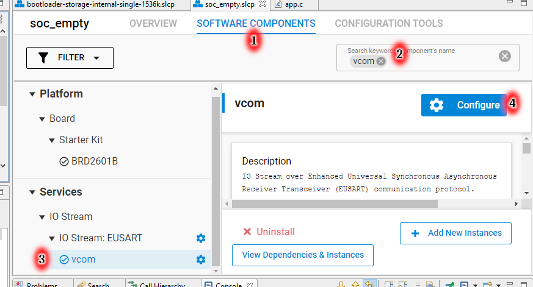
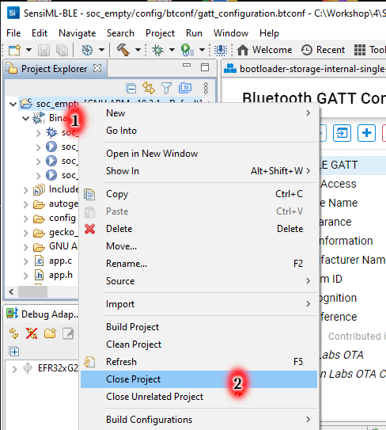
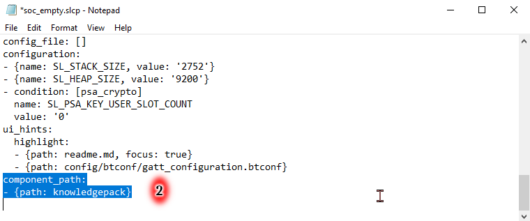
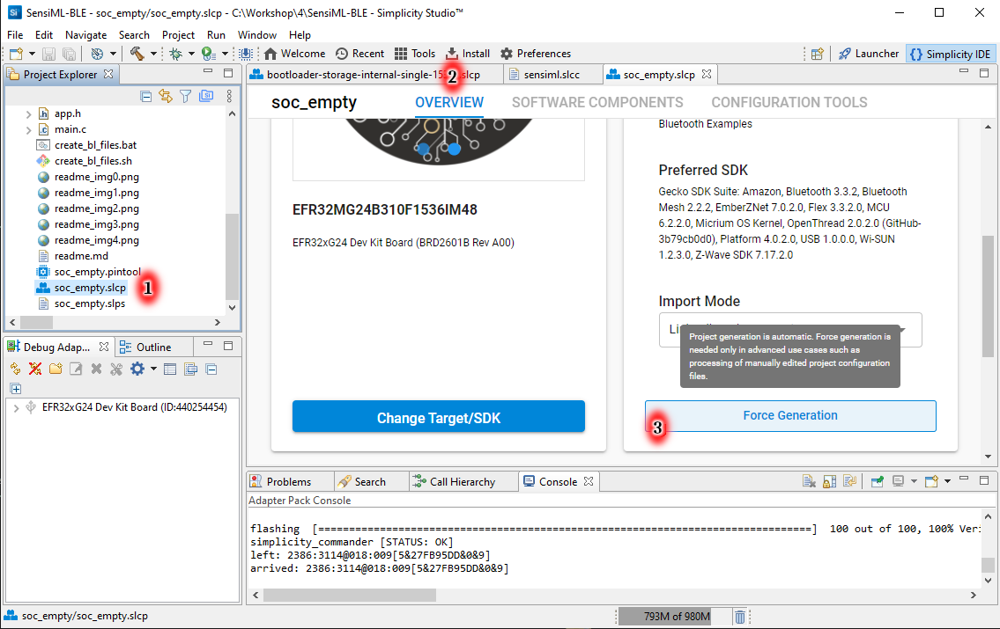

# How to Use Peripherals and Sensors to Gather and Report Data

This Workshop will require:
* Computer with Simplicity Studio 5 v5.3.2 or greater and GSDK 4.0.2 or greater
* EFR32xG24 Dev Kit Board BRD2601B
* Mobile device with EFR Connect app

Option to use:
* SensiML Knowledge Pack which will have been created in an earlier workshop

---
# 1 Introduction 

In this workshop we are going to integrate a knowledge pack, which was
produced in Session 2 presented by SensiML, into a Bluetooth project and
leverage the power of machine learning to reduce a stream of data from
the microphone down to a few Bluetooth notifications.

To summarize the steps we are going to take in this workshop:
* Build and install a bootloader
* Create SOC empty app we can connect with ERF Connect
* Integrate a SensiML knowledge pack into the application
* Verify operation

## A few notes on content.
* When referring to a key or key combination I will enclose the key name within square brackets.  For example, "[Ctrl]-[S]" represents pressing the "S" key while holding down the "Control" key.
* In cases where it would be convenient to cut and paste some text, I will present the text as
<pre>
Text to cut-n-paste.
</pre>

# 2 Introduction to Simplicity Studio

## 2.1 Launcher Welcome
When opening simplicity studio for the first time you should be greeted with the following welcome screen.  Note this is the launcher perspective.  If you are not in the launcher perspective, you can click on the launcher button (1) in the upper bar.

With the EFR32xG24 Dev Kit attached to the computer via USB cable you should see an entry in the debug adapters panel at the left (2).  Click on the EFR32xG24 Dev Kit entry.

## 2.2 Launcher Overview
Select the "Overview" tab (1).  Verify that you have the current gecko SDK selected in the dropdown (2).

## 2.3 Workaround Possible Issue

If you observe the following error after connecting xG24 Dev Kit, click Debug Mode Change link (1).

In the following dialog, toggle dropdown (2) from MCU to off, then back to MCU, waiting for change to be applied each time.  Do not close the dialog with OK button, clickk Cancel (3).

## 2.4 Simplicity Commander

To open Simplicity Commander, with xG24 Dev Kit debugg adapter selected in Debug Adapters panel, click COMPATIBLE TOOLS tab (1), then click Launch button (2).

Connect to xG24 using dropdown (4) to select serial number (same as displayed in Debug Adapter panel)

In Kit View (4) Commander displays VCOM port (5).

# 3 Installing Gecko Bootloader

As noted in slides, you may need to flash the bootloader more frequently than the average Bluetooth developer.

## 3.1 Example Projects & Demos
In the Launcher Perspective, and the xG24 Dev Kit debug adapter selected in the Debug Adapters panel,  
select the example "Example Projects & Demos" tab (1).  Since the EFR32xG24 Dev Kit has 1536Kb flash and the bootloader we are want is named according to this, we can filter on the keyword 1536kb.  We should find the "Internal Storage Bootloader (single image on 1536kB device).  Click on the "Create" button (3).

## 3.2 Bootloader New Project Wizard 
In the "New Project Wizard" dialogue, we retain the defaults and click finish (1).

## 3.3 Bootloader Build
A new bootloader project configured for the EFR32xG24 has been created in the IDE.  Right-click on the name of the project in the "Project Explorer" panel (1), then select "Build Project" (2) from the context menu.

## 3.4 Bootloader Open Flash Dialog
When the build has completed, open the "Binaries" folder (1), right-click on either the ".s37" or ".hex" files (2) then select "Flash to Device" (3) from the context menu. 
 

## 3.5 Bootloader Erase and Flash
Since we will be flashing the application later, we can safely erase the entire flash by clicking the "Erase" button (1).  This should not be done as a rule when flashing an application which requires a bootloader if the bootloader is already present.  Write the bootloader image to flash by pressing "Program" button (2).

# 4 Import the Final Project

This section is only intended for participants in the workshop.  It does not contain any of the required steps to generate the final project.  This section is intended to provide a fall back plan so that if a participant is unable to follow all required steps, that they will have a working project to work with.

Download this file: [mg24_tech_lab_session_4.sls](SimplicityStudio/mg24_tech_lab_session_4.sls)

Make a note of the folder where it has been downloaded.

Open the File menu (1), select Import (2)

Click the Browse button (3) on the Project Search dialog.

Navigate to to folder containing downloaded file.  Click Select button.

Select project name on Project Search dialog, then click Next button.

Click Next button on Build Configurations of the Project dialog.

Click Finish button on Project Configuration dialog.

Project will appear in Project Explorer.

# 5 Create new project based on Bluetooth SoC Empty

## 5.1 Return to Launcher Perspective
From the Launcher perspective, with the EFR32xG24 Dev Kit selected in the "Debug Adapters" panel, select the "Example Projects & Demos" tab, and filter on the keyword "soc empty".  Click "Create" on the project called "Bluetooth - SoC Empty" (1).  In the "New Project Wizard" dialog, you may wish to change the name of the project, otherwise follow same steps as for creating Bootloader project.

## 5.2 Bluetooth GATT Configurator
When the new project is open in the Simplicity IDE, select the "gatt_configuration.btconf" (1).  This is the tool with which we edit the structure of the static GATT database. If you do not have "gatt_configuration.btconf" open, you can locate it in the "Project Explorer" in the folder "config/btconf". 

## 5.3 Change Device Name
First we change the name the device advertises.  Click the "Device Name" characteristic (1) in the "Generic Access" service.  Modify the initial value (2).  Deselect the check box beside the value length (3) this will cause the length to be calculated from the string entered.
  

##  5.4 Add Custom Service
We will now add a custom service to contain the characteristic to be used for notifications.  Click on the "add new item" icon (1).  Select "Add Service" from the menu.

## 5.5 Rename Custom Service
Click on the newly created service which will be named "Custom Service".  The name can be changed by editing the service name (2).  Here I have renamed the new custom service "ML Recognition".

## 5.6 Add Custom Characteristic
With the new service selected, click on the "add new item" icon (1), select "Add Characteristic" from menu.

Select the newly created characteristic. It may be necessary to expand the new service to see the characteristic.

 
## 5.7 Rename Characteristic and Provide Macro for Handle
Rename the new characteristic (1).  Select the check box and enter a string for the ID.  This will generate a macro which will have the value of this characteristics handle.  In this example I enter "inference" as the ID, in "gatt_db.h" the macro defined will be "gattdb_inference".

## 5.8 Set Properties
Since this characteristic is going to be ephemeral, we don't need to allocate space in the GATT database for it.  Select "USER" (1).  Enable the "Notify" property (2).

## 5.9 Save GATT database

With gatt_configuration.btconf file active in the editor, type [Ctrl]-[S] to save the file.  The star next to the filename should disappear.

 should become 

## 5.10 Remove OTA DFU Component

Select project .slcp file (1).  Select SOFTWARE COMPONENTS tab (2).  Enter "ota" into keyword filter (3).  Select OTA DFU component (4).  Click Uninstall (5).

After this step you can verify that the OTA Service and OTA Control
characteristic are removed from GATT configuration.

## 5.11 Tune Bluetooth Features

Select project .slcp file (1).  Select SOFTWARE COMPONENTS tab (2).  Clear keyword filter (3).  Check Installed Components checkbox (4).  Uninstall Scanner (5), GATT Client (6) and Security Manager (7).

## 5.12 Add Legacy Advertising Component

Clear Installed Components checkbox (1), enter "legacy" into keyword filter (2), select Legacy Advertising component (3), click Install (4).

## 5.13 Add Services / IO Stream / IO Stream EUSART

Enter "ios" into keyword filter (1), install IO Stream EUSART component (2)

Click Done (2) to accept vcom as name of EUSART instance.

## 5.14 Configure IO Stream EUSART vcom

Under "Software Components" tab (1), enter "vcom" into search box (2), locate the "vcom" instance (3) of "IO Stream: EUSART" and select.  Click "Configure" (4).

If you will be using SensiML's Data Capture Lab to collect data frequently it would make sense for you to set the the baudrate (5) to 921600 and leave the board controller UART at 921600.  If are using the EFR32xG24 Dev Kit with other demos and projects which use the default 115200 baud, leave as is.  We will cover setting the EF32xG24 Dev Kit board control baudrate a little later.

  
## 5.15 Add Application / Utility Log Component
Since the "TensorFlow Lite Micro" already required an "IO Stream" component for debugging, we may as well include some logging output of our own.  Again under the "Software Components" tab (1), enter "log" into the search box (2), select the "Log" component (3) under "Application" / "Utility" and click "Install" (4).

## 5.16 Update app.c
Cut and paste the contents of this [app.c](bt_soc_empty_test/app.c) in to the project.

## 5.17 Build Application
**Save the GATT database by typing [Ctrl]-[s].**  There is a small issue with the build sequence so that the GATT database gets saved late, which results in lag, that is, changes made will not appear until the next build if the build is started before saving.
As with bootloader, right-click on project name (1), then select "Build Project" (2)

## 5.18 Flash Application
At completion of build, right-click on a ".s37" or ".hex" file in the "Binaries" folder (1), then select "Flash to Device" (2) from menu.  This time, however, since you have already flashed the bootloader, do not click "Erase" button, only "Program" button.

# 6 Testing the Bluetooth Application

## 6.1 Setting Board Controller Baudrate

This subsection documents setting the Board Controller UART baudrate.  The default baudrate for example projects is 115200.  The baudrate entered here should match the setting of EUSART in [Configure IO Stream EUSART vcom](#514-configure-io-stream-eusart-vcom) section.

Unlike USB Serial adaptors, the baudrate set on the computer does not set the baud rate used by the virtual serial port on the EFR32xG24 Dev Kit.  There is a UART on the board which is attached to the VCOM pins of the MCU, the baudrate of this UART must match the baudrate set on the MCU.  The properties of the Board Controller UART may be set by right-clicking on the EFR32xG24 Dev Kit in the "Debug Adapters" panel (1).  Select "Launch Console" from menu (2).

Select the "Admin" tab (3).  Click in the text entry box (4).  Press [Enter] a few times until the "TB>" prompt appears.

The baudrate may be set with the command
<pre>
serial vcom config speed 921600
</pre>

entered into the text box, executed with  [Enter] key.

## 6.2 Use EFR Connect
Open the EFR Connect mobile app.  Select the "Develop" view (1), then select "Browser" (2).  After scanning momentarily, you should see the EFR32xG24 advertisement (3), the name will probably be abbreviated, but the full name is visible bin the details (4).  Connect to the device (5).

You should see the custom service listed.  EFR Connect will not be aware of the name used in the GATT Configurator and will refer to is as "Unknown Service".  To examine the characteristics contained, tap "More Info" (6).  This should list an "Unknown Characteristic" and list the "Notify" permission (7).  Tapping "Notify" will toggle the value written to the Client Characteristic Configuration descriptor to request or halt notifications of the characteristic.

Notifcation should appear are legible messages in the ASCII representation.

# 7 Adding SensiML Knowledge Pack to Project

Currently Simplicity Studio does not support importing Partner Software components, so we will need to manually edit the project ".slcp" file.

If you do not have your own knowledgepack, you can download this [knowledgepack.zip](src/knowledgepack.zip)

## 7.1 Close The Project
Right-click on the project name in the "Project Explorer" (1), then select "Close Project" from the menu (2).  When the project is in the closed state, it will not display ">" to the left of the name (3).

## 7.2 Unzip Knowledge Pack into Project
Unzip the Knowledge Pack into the folder which is the root of the project. This can be done by right-clicking on the closed project (1) and selecting "Browse Files Here" (2) from the menu.  Open "knowledgepack.zip" in another window and drag the "knowledgepack" folder (3) from the zip into the project root folder (4).

## 7.3 Edit SLCP File
Open the ".slcp" file in the root folder of the project with a text editor.  Navigate down to the line "component:".  After this line add the following line (1).
<pre>
- {id: custom_sensiml}
</pre> 

Navigate to the end of the file (2) and add the following two lines, then save.:
<pre>
component_path:
- {path: knowledgepack}
</pre>

## 7.4 Edit sensiml.slcc file

Open knowledgepack/sensiml.slcc in a text editor.  Navigate down to
the line "source:".  Delete this and the two following lines (1),
three lines in total.  Save sensiml.slcc

## 7.5 Reopen Project

Reopen the project in Simplicity Studio by double-clicking on the project name.  The "knowledgepack" folder (1) should be visible.  

## 7.6 Regenerate Project

Locate the ".slcp" file in the "Project Explorer" (1).  Double-click to open.  In the Overview tab (2), click the "Force Generation" button (3).  This will reparse the modified ".slcp" file and incorporate the contents of "sensiml.slcc".  During project generation, you can see progress reported in bar at the bottom right of Simplicity Studio.

## 7.7 Add Microphone Driver
Switching to the "Software Components" tab of (1) the ".slcp" file, type "microphone" into the search box (2).  Locate the "Sound level sensor (microphone)" (3), click to select.  A description should appear and an "Install" button (4).  Click "Install" button to add this component to the project.  Dependencies of this component will automatically be installed.

 

## 7.8 Update app.c

Completely replace the contents of "app.c" in the project with the contents of this link: [app.c](src/app.c).

## 7.9 Build and flash

Build the application as before.  Flash application as before.

## 8 Testing

Use EFR Connect as before.  Remember to enable notifications of the custom characteristic.  Now inferences should appear as the ASCII
note names as recognized by the SensiML Knowledge Pack.  This is Youtube video is recommended for verifying operation: [Guitar Tuning Notes - Standard EADGBE](https://www.youtube.com/watch?v=DlMrl3EQ1bs).

Monitoring the virtual COM port you should see the logging output.
<pre>
[I] SensiML + BLE example
[I] Advertising started
[I] Connection opened
[I] Collection, analysis and notification starting
Create Interpretor
Allocate Tensor Arena
FOUND TENSOR SIZE: 1636
[I] Collection, analysis and notification stopped
[I] callbacks: 591, overrun: 0, max_lag: 3072
[I] Samples processed: 605184, notifications attempted: 33, notifications sent: 33
[I] 136280 ticks of analysis, 1311292 total ticks, 10 % spent processing data
[I] Connection closed
[I] Advertising started
</pre>

# Final Notes

## Bluetooth Events of Interest

Recalling that events are delivered from the Bluetooth stack to sl_bt_on_event(evt), the following events will be handled:
* [sl_bt_system_boot](https://docs.silabs.com/bluetooth/3.3/a00032) -- this event indicates that the Bluetooth stack is initialized and ready to receive commands.  We will start advertising using [sl_bt_legacy_advertiser_start()](https://docs.silabs.com/bluetooth/3.3/a00043#gafbe2b47ed2e88b2c96ef028e1df388d3) which will generate a default advertising packet including the device name pulled from in the GATT database Characteristic, "Device Name", in the Generic Access service.
* [sl_bt_evt_connection_opened](https://docs.silabs.com/bluetooth/3.3/a00056) -- this event indicates the a central has sent a connection request and the devices are now connected.  This event will include the connection handle which will be required to send notifications.
* [sl_bt_evt_gatt_server_characteristic_status](https://docs.silabs.com/bluetooth/3.3/a00083) -- this event has two purposes, reporting that the client has acknowledged an indication, or reporting that the client has written to the Client Characteristic Configuration descriptor which generally indicates a request to enable or disable notification or indication.  We will enable or disable data connection, analysis and notification of inferences accordingly.
* [sl_bt_evt_connection_closed](https://docs.silabs.com/bluetooth/3.3/a00063) -- indicates connection has closed.  If data collection and processing are active they should be halted.  Advertising will be restarted.

## I2S Microphone Driver

The following functions from the I2S Microphone Driver are used:
* [sl_mic_init(uint32_t sample_rate, uint8_t channels)](https://docs.silabs.com/gecko-platform/4.0/hardware-driver/api/group-mic#ga9aa3bd76e231fbb07881f0624c70f9f0)
* [sl_mic_start_streaming(void *buffer, uint32_t n_frames, sl_mic_buffer_ready_callback_t callback)](https://docs.silabs.com/gecko-platform/4.0/hardware-driver/api/group-mic#ga8af3c88d412442d8d6f6de3f6b8267a1) --- will be used as a ping-pong buffer, echo of length n_frames, so sizeof(buffer) >= channels * n_frames * sizeof(int16_t)
* [sl_mic_stop (void)](https://docs.silabs.com/gecko-platform/4.0/hardware-driver/api/group-mic#ga61629107c3fcb1ef74cfce4be05c1617) --- used to halt data collection, analysis and notification when halting notifications requested by client, or connection loss.

## Knowledge Pack API calls

The following API calls are used:
* `void kb_model_init()` --- Initialize the parameters of all the models, this function must be run before calling any other functions in the knowledge pack. 
* `int kb_reset_model(int model_index)` --- Advance the model so it is ready for new sample data. Call this after very classification event is received prior to passing in more data.
* `int kb_run_model(SENSOR_DATA_T *pSample, int nsensors, int model_index)` --- Stream single sample of data into model pipeline.  This is the main entry point into the pipeline. It is designed to work on streaming data and takes a single timepoint of data as an array as input.

Additional comments are found at [Calling Knowledge Pack APIs from your code](https://sensiml.com/documentation/knowledge-packs/building-a-knowledge-pack-library.html#calling-knowledge-pack-apis-from-your-code)
Apploader is a standalone application which can be used to perform Over-The-Air (OTA) Device Firmware Upgrades (DFU).  You can read more about this feature in [AN1086](https://www.silabs.com/documents/public/application-notes/an1086-gecko-bootloader-bluetooth.pdf).

[UG434: Silicon Labs Bluetooth® C Application Developer's Guide for SDK v3.x](https://www.silabs.com/documents/public/user-guides/ug434-bluetooth-c-soc-dev-guide-sdk-v3x.pdf) will be useful for further details.  Section 4.2 describes the components mentioned above.
