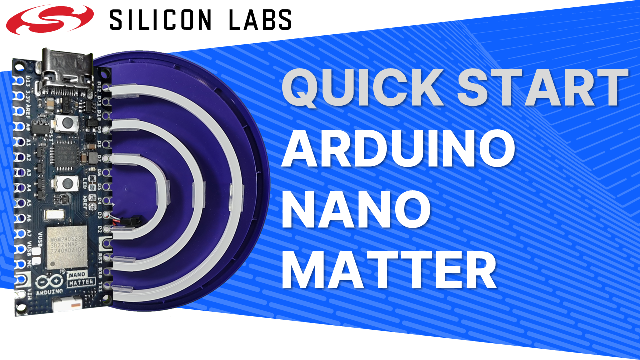
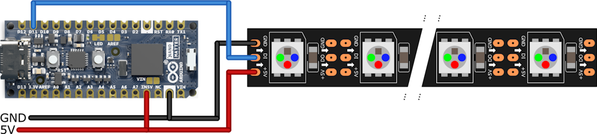
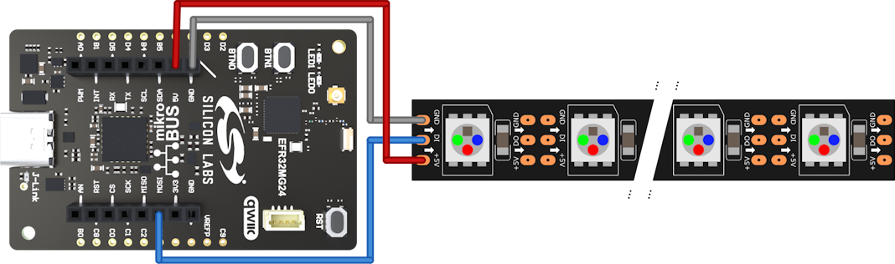
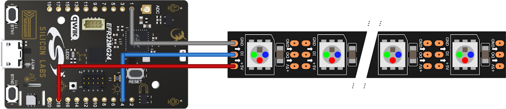
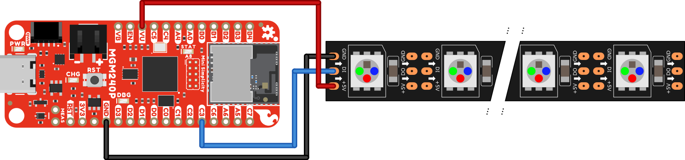

# Quick Start: Arduino Nano Matter

## About

The video for this Dev Lab is available on [YouTube](https://youtu.be/7pXFT4D3ui4), where the video description includes links to further information.

This quick start video introduces the Arduino Nano Matter board and shows how to get started developing Matter over Thread applications. In the video the Matter Dimmable Lightbulb example is adapted to drive and animate a WS2812 RGB LED strip to display the brightness of the light. This example makes the final source code available for download and use.

## Usage

### Commissioning

Commissioning into a Matter over Thread network follows the normal process of scanning a QR or entering a manual code in the app for your chosen Matter ecosystem. For Google Home you may need to enable test certificates in the Google Developer Console for your Google Home account, the [Quick Start - Matter in Google Home](https://youtu.be/R_kpSO7PtUo) YouTube video walks through this process.

A URL to the QR Code and the manual code are both output by the application to the serial port during start up. 

### Control

The light can be turned off and on and the brightness set using the chosen ecosystem's mobile application or smart assistant.

## Hardware

The software is written to run on the Arduino Nano Matter board but is also compatible with other Silicon Labs EFR32MG24 development boards. Wiring diagrams for compatible boards are shown below. Some boards are able to provide 5V power for WS2812 LEDs however, they can draw a lot of current so an external power supply is advised. 

### Arduino Nano Matter

### Silicon Labs xG24 Explorer Kit

### Silicon Labs xG24 Dev Kit

### SparkFun Thing Plus MGM240P Matter

